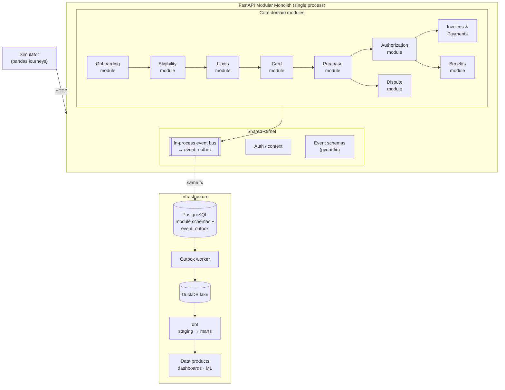
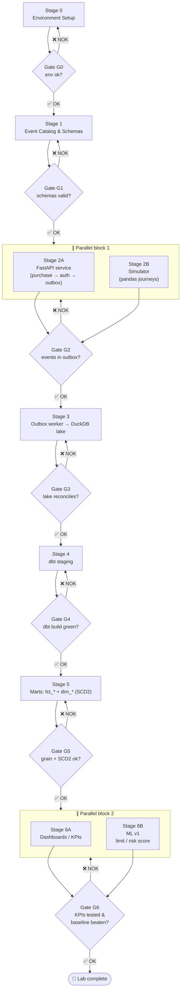

# Execution Plan — card-data-lab

This plan operationalizes the [README](README.md): it sequences the work as a DAG of stages, defines **gates** (go/no-go criteria) between stages, and highlights what can run **in parallel**.

## Legend

| Symbol | Meaning |
|---|---|
| ✅ Gate OK | All exit criteria met → proceed to next stage |
| ❌ Gate NOK | Criteria failed → fix before proceeding |
| ∥ | Can be executed in parallel with the sibling track |

---

## Iteration Tracker

Use this table as the single source of truth for day-to-day progress. Update **Status** as you iterate; the **Tester** column names the check (command or test) that flips the status.

Status values: `todo` → `doing` → `review` → `done` (or `blocked`).

| Phase | Feature | Tester | Status |
|---|---|---|---|
| 0 — Environment | Docker Postgres running | `docker ps` shows healthy container | todo |
| 0 — Environment | Repo scaffold (`services/`, `simulator/`, ...) | folders exist | todo |
| 0 — Environment | uv project initialized (`pyproject.toml`, lockfile) | `uv sync` succeeds | todo |
| 0 — Environment | taskipy tasks defined | `uv run task --list` shows all tasks | todo |
| 1 — Schemas | Event catalog finalized (10 types) | schema review vs README catalog | todo |
| 1 — Schemas | Pydantic models per event | `uv run task test` (schema tests) | todo |
| 1 — Schemas | OLTP DDL + `event_outbox` migration | fresh DB applies cleanly | todo |
| 2A — Service | Purchase → authorization API | `uv run task test` (API tests) | todo |
| 2A — Service | Outbox write in same transaction | integration test: rollback check | todo |
| 2B — Simulator | Client/journey generator (pandas) | ≥100 clients, ≥1 month of events | todo |
| 2B — Simulator | Fraud/default rate parameterization | config knobs produce different distributions | todo |
| 3 — Lake | Outbox worker → DuckDB append | row counts reconcile outbox ↔ lake | todo |
| 3 — Lake | Idempotency by `event_id` | re-run worker: no duplicates | todo |
| 4 — Staging | dbt project with DuckDB target | `uv run task dbt-build` passes | done |
| 4 — Staging | Staging models + tests | `not_null` / `unique` green | done |
| 5 — Marts | `fct_purchases`, `fct_authorizations` | grain check: 1 row = 1 event | done |
| 5 — Marts | `dim_client`, `dim_card` (SCD2), `dim_date` | no overlapping validity ranges | done |
| 6A — Dashboards | KPI models (5 KPIs) | one dbt test per KPI, all green | todo |
| 6B — ML | Limit / risk baseline model | beats naive benchmark on holdout | todo |

> Tip: keep this table at the top of PR descriptions or paste it into your standup notes; each row maps 1:1 to a gate criterion in the stages below.

## Work Breakdown Tracker (gate → WP → task)

Fine-grained iteration table: each row is one executable step. **WP** = work package, **Step** = how to execute it, **Test** = the check that flips status to `done`.

Status values: `todo` → `doing` → `review` → `done` (or `blocked`).

| Gate | WP | Task | Step execution | Test | Status |
|---|---|---|---|---|---|
| G0 | WP0.1 — Infra | Postgres container | `uv run task infra` | `docker ps` shows `cardlab-postgres (healthy)` | done |
| G0 | WP0.2 — Scaffold | Repo folders | create `services/`, `simulator/`, `oltp/`, `worker/`, `warehouse/`, `tests/`, `learn-diary/` | folders exist | done |
| G0 | WP0.3 — Env | uv project + lockfile | `pyproject.toml` + `uv sync` | `.venv` created; `uv.lock` committed | done |
| G0 | WP0.4 — Env | taskipy tasks | define `[tool.taskipy.tasks]`; see [execute_project.md](learn-diary/execute_project.md) | `uv run task --list` shows all tasks | done |
| G1 | WP1.1 — Catalog | Event catalog (10 types) | write `services/shared/catalog.py` enums + payload models | `pytest tests/test_schemas.py::test_catalog_has_all_10_event_types` | done |
| G1 | WP1.2 — Schemas | Pydantic envelope & payloads | implement `services/shared/events.py` (`BaseEvent`, header) | `uv run task test-unit` green | done |
| G1 | WP1.3 — OLTP DDL | Domain schemas + outbox | write `oltp/migrations/001_initial_schema.sql`; `uv run task migrate` | `pytest tests/test_database.py::test_all_domain_tables_exist` | done |
| G1 | WP1.4 — DB tests | Database pytest suite | write `tests/test_database.py` (constraints, outbox PK/indexes) | `uv run task test-db` all green | done |
| G2 | WP2A.1 — Service | FastAPI app + module routers | create `services/main.py`, `services/modules/purchase/` | API smoke test: POST purchase returns approved/declined | done |
| G2 | WP2A.2 — Service | Authorization rules | limit check + decline reasons in module service layer | unit tests for approve/decline paths | done |
| G2 | WP2A.3 — Service | Transactional outbox write | persist business rows + `event_outbox` in same tx | integration test: rollback removes both | done |
| G2 | WP2B.1 — Simulator | Client/journey generator | implement `simulator/run.py` (pandas) | ≥100 clients, ≥1 month of events in outbox | done |
| G2 | WP2B.2 — Simulator | Fraud/default knobs | parameterize rates via config | different configs → different distributions | done |
| G3 | WP3.1 — Lake | Outbox worker | implement `worker/outbox_to_duckdb.py`; `uv run task lake` | row counts reconcile outbox ↔ lake | done |
| G3 | WP3.2 — Lake | Idempotency | dedup by `event_id` on append | re-run worker: no duplicate rows | done |
| G3 | WP3.3 — Tooling | Layered fast test suite | markers (unit/db/slow) + `test-unit` / `test-fast` / `test-all-ordered` tasks | `uv run task test-all-ordered` 27 passed | done |
| G4 | WP4.1 — Staging | dbt project init | `warehouse/` with DuckDB target | `uv run task dbt-build` passes | done |
| G4 | WP4.2 — Staging | Staging models + tests | 1 model per source stream, typed/renamed | `not_null` / `unique` green | done |
| G5 | WP5.1 — Marts | Facts (`fct_purchases`, `fct_authorizations`) | build on staging; declare grain in schema.yml | grain uniqueness test passes | done |
| G5 | WP5.2 — Marts | Dimensions SCD2 (`dim_client`, `dim_card`) + `dim_date` | dbt snapshots; validity ranges | no overlaps/gaps; 1 current row per key | done |
| G6 | WP6A.1 — Dashboards | 5 KPI models | numerator/denominator pattern (see [data_modelling.md](learn-diary/data_modelling.md) §7) | one dbt test per KPI, all green | done |
| G6 | WP6B.1 — ML | Limit / risk baseline model | features from facts; holdout evaluation | beats naive benchmark on holdout | done |

> A gate is ✅ only when every row under it is `done`. Update this table as you iterate — it's the operational view; the stage descriptions below are the reference.

## Stages & Gates

### Stage 0 — Environment Setup
**Work**
- Install Docker; pull `postgres` image (see README Setup section)
- Scaffold repository structure (`services/`, `simulator/`, `oltp/`, `warehouse/`, `data_products/`, `airflow/`, `docs/`)
- Initialize **uv** project for a locked, replicable environment:
  - `uv init` → generates `pyproject.toml`
  - `uv add fastapi uvicorn pandas duckdb dbt-duckdb sqlalchemy psycopg2-binary pytest` → pinned deps + `uv.lock`
  - Commit `uv.lock`; anyone reproduces the env with a single `uv sync`
- Add **taskipy** for consistent task commands across machines:
  - `uv add --dev taskipy`
  - Define tasks in `pyproject.toml`:
    ```toml
    [tool.taskipy.tasks]
    infra = "docker compose up -d"
    api = "uvicorn services.main:app --reload"
    simulate = "python -m simulator.run"
    lake = "python -m worker.outbox_to_duckdb"
    dbt-build = "cd warehouse && dbt build"
    dbt-test = "cd warehouse && dbt test"
    test = "pytest -q"
    check = "task test && task dbt-test"   # gate runner
    ```
  - Run anything via `uv run task <name>` — same commands on every machine/CI

**Gate G0** — ✅ if: Postgres container runs and accepts connections · all folders exist · `uv sync` restores the exact environment from `uv.lock` · `uv run task check` executes end-to-end.


### Stage 1 — Event Catalog & Schemas
**Work**
- Finalize event catalog (10 event types from README)
- Define JSON payload schemas (pydantic models per event)
- Create OLTP DDL/migrations for all domain tables + `event_outbox`

**Gate G1** — ✅ if: every `event_type` has a versioned schema · DDL applies cleanly on a fresh database · pydantic models validate sample payloads.

### Stage 2 — Core Services & Simulator  *(two parallel tracks)*
**Track A (∥)** — Thin FastAPI service end-to-end: purchase → authorization → persist state + outbox event.
**Track B (∥)** — Synthetic journey generator (pandas): N clients with properties, onboarding + purchases over simulated months, parameterized fraud/default rates.

**Gate G2** — ✅ if: API returns approved/declined correctly for test cases · simulator produces ≥ 1 month of events for ≥ 100 clients · events land in `event_outbox` in the same transaction as business tables.

### Stage 3 — Outbox Worker → DuckDB Lake
**Work**
- Worker (or Airflow task) reads unpublished outbox rows and appends raw events to DuckDB (partitioned by `dt_event`)
- Idempotency: dedup by `event_id`

**Gate G3** — ✅ if: re-running the worker does not duplicate rows · row counts reconcile between outbox and lake · query latency acceptable on simulated volume.

### Stage 4 — dbt Staging Layer
**Work**
- dbt project configured with DuckDB target
- `staging` models: one per source table/event stream, typed and renamed

**Gate G4** — ✅ if: `dbt build` passes · all staging tests (`not_null`, `unique`) green.

### Stage 5 — Marts (first slice)
**Work**
- `fct_purchases` + `fct_authorizations`
- `dim_client` (SCD2), `dim_card` (SCD2), `dim_date`

**Gate G5** — ✅ if: grain documented and verified (1 row = 1 purchase / 1 auth attempt) · SCD2 validity ranges never overlap · `relationships` tests pass.

### Stage 6 — Data Products  *(two parallel tracks)*
**Track A (∥)** — Dashboard KPIs: approval rate, TPV, delinquency rate, limit utilization, activation rate (one dbt model + one test each).
**Track B (∥)** — ML v1: credit limit assignment / default risk score using features from facts (avg ticket, spend velocity, payment ratio).

**Gate G6** — ✅ if: each KPI model has a passing test · ML baseline beats a naive benchmark on holdout · metrics documented in `docs/`.

---

## Architecture: Modular Monolith

Instead of microservices, all bounded contexts live in **one deployable FastAPI application**, organized as internal **modules** with explicit boundaries:

- Each module owns its tables and publishes events — no module reads another module's tables directly; integration happens through the **event bus / outbox**.
- One process, one database, one deployment → far simpler to run in this lab, while keeping the option to extract a module into its own service later (the seams are already there).



**Module boundaries = future service boundaries.** If a module needs independent scaling (e.g., Authorization), it can be extracted as a microservice without changing the event contracts.

### How this changes the plan

- **Stage 2A** builds *one* FastAPI app with module routers (`services/modules/<context>/`), not multiple services.
- The **in-process event bus** replaces pub/sub: handlers subscribe to events, and every published event is also written to `event_outbox` in the same transaction.
- Stages 3–6 are unchanged — they only consume `event_outbox`, so they don't care whether it came from a monolith or microservices.

---

## Execution DAG



## What can run in parallel

| Parallel block | Tracks | Why it's safe |
|---|---|---|
| **Block 1** (after G1) | 2A service ↔ 2B simulator | Both only depend on schemas (G1); they meet at the outbox (G2). Contract is the event schema, so no coupling. |
| **Block 2** (after G5) | 6A dashboards ↔ 6B ML | Both consume read-only marts; neither mutates warehouse state. |

Everything else is strictly sequential because each stage's output is the next stage's input (schemas → services → lake → staging → marts).

> Note: with the modular monolith, "service" work in Stage 2 means *modules inside one app* — the parallel tracks still hold, since 2A (modules + bus) and 2B (simulator) only share the event schema contract.

## Suggested order of execution (critical path)

```text
S0 → S1 → [S2A ∥ S2B] → S3 → S4 → S5 → [S6A ∥ S6B]
```

Estimated critical path: Stages 0–5 sequential; parallel blocks roughly halve the effort of Stages 2 and 6.
