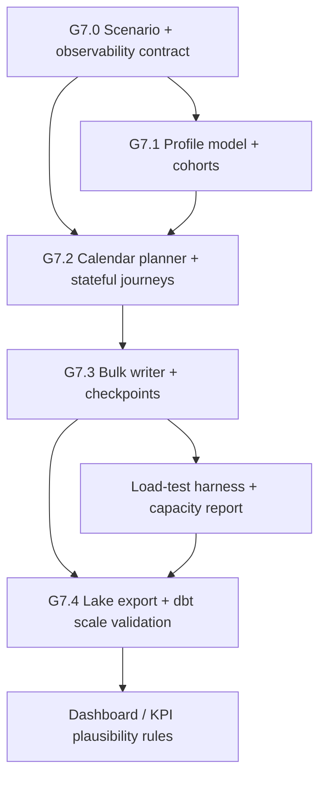

# Execution Plan — card-data-lab

This is the operational companion to [README.md](README.md). It records what is implemented, what has been verified, and the next gates needed to turn the lab into a coherent end-to-end credit-card data platform.

## Status rules

| Status | Meaning |
|---|---|
| `done` | Code exists and its stated gate has passed. |
| `review` | Code exists, but an integration, contract, or quality gate remains. |
| `todo` | The capability is not implemented yet. |

## Verified snapshot

| Check | Result |
|---|---|
| Unit suite | `25 passed` with `pytest -q -m unit` |
| Full project suite | `27 passed` with `uv run task test-all-ordered` after applying the migration to local PostgreSQL |
| Warehouse build | Real `lake/events.duckdb`: 12 physical dbt tables + 44 data tests; `56` checks passed |
| Catalog migration | Legacy raw history copied to `bronze.raw_events`; bronze/silver/gold schemas materialized successfully |
| KPI slice | Five KPI models plus `gold.obt_client_360` compile and pass dbt tests |
| Dashboard | `dashboard/app.py` compiles; it reads the KPI marts read-only |
| Limit baseline | Random forest MAE beats the naive mean predictor on the sample lake |
| Full ML suite | Only the credit-limit model beats its benchmark; risk and income models remain below gate |
| PostgreSQL-backed suite | Migration and database-backed tests ran successfully against local PostgreSQL |

> DuckDB allows one writer. Run the outbox worker and dbt sequentially when they share `lake/events.duckdb`; the dashboard and ML scripts are read-only consumers.

## Iteration tracker

| Gate | Phase | Deliverable | Tester | Status |
|---|---|---|---|---|
| G0 | Environment | Repository scaffold, Docker Compose, uv lockfile, and taskipy commands | `uv run task --list` | done |
| G1 | Contracts | Ten-event catalog, Pydantic envelope/payloads, and OLTP migration | `pytest -q -m unit`; fresh migration with PostgreSQL | done |
| G2A | Service | FastAPI purchase authorization and transactional outbox | API + rollback tests with PostgreSQL | review |
| G2B | Simulator | Seeded clients, cards, purchases, fraud and decline knobs | Simulator tests with PostgreSQL | review |
| G3 | Lake | Outbox worker, idempotent bronze append, reconciliation helper | Lake integration tests with PostgreSQL | review |
| G4 | Bronze staging | Physical bronze staging tables and source contract | `dbt build` | done |
| G5 | Silver marts | Physical silver facts/dimensions and SCD2 assertions | `dbt build` | done |
| G5.1 | Card history | `dim_card` SCD2 and card-event history | New table + validity/relationship tests | todo |
| G6A | Gold products | Physical KPI/OBT tables and Streamlit dashboard | `dbt build`; dashboard smoke test | done |
| G6B | ML | Limit baseline and multi-model training experiment | Holdout benchmarks | review |
| G7.0 | Scale contract | Six-month scenario, event mix, profile dictionary, and acceptance criteria | Contract review + deterministic sample | todo |
| G7.1 | Enriched profiles | Synthetic profile model and lifecycle state | Distribution and referential-integrity tests | todo |
| G7.2 | Calendar journeys | Deterministic daily event engine and behavior cohorts | Daily-volume, timestamp, and event-sequence tests | todo |
| G7.3 | Bulk generation | Batched OLTP/outbox writer, run manifest, checkpoints, and resume | Restart/idempotency and throughput report | todo |
| G7.4 | Warehouse scale | Incremental lake export and layered dbt build at scale | Reconciliation + dbt build + KPI plausibility checks | todo |

## Current architecture contract

```text
FastAPI authorization API / simulator
                │
                ▼
PostgreSQL business tables + event_outbox (one transaction)
                │
                ▼
outbox worker → DuckDB bronze.raw_events → dbt bronze → silver → gold → KPIs / OBT / ML
```

### Important contract to close

The warehouse staging model treats `event_outbox.aggregate_id` for purchase events as `client_id` and expects `card_id` in the payload. The simulator follows that convention. The HTTP authorization service currently emits purchase events with `card_id` as the aggregate and does not add `card_id` to the payload.

Before API-generated purchase events and simulator-generated events are mixed in the same mart, standardize one contract—preferably `aggregate_id = client_id` and `payload.card_id = card_id` for analytical purchase events—or add an explicit normalization layer. This is the highest-priority integration follow-up because it directly affects fact-to-dimension relationships.

## Work breakdown

| Gate | Work package | What exists | Next action |
|---|---|---|---|
| G0 | Environment | `pyproject.toml`, `uv.lock`, `docker-compose.yml`, taskipy commands | Start Postgres before DB-backed verification |
| G1 | Event contracts | `services/shared/events.py`, `catalog.py`, migration DDL | Verified by the local migration and database-backed suite |
| G2A | Authorization | `/health`, `POST /api/purchases/authorize`, unit domain rules | Align its purchase-event aggregate contract with the warehouse |
| G2B | Simulator | `simulate()` generates ≥100 client journeys with fraud/decline controls | Run PostgreSQL test suite; emit the full onboarding/card lifecycle over time |
| G3 | Lake | `worker/outbox_to_duckdb.py`, deduplication, reconciliation | Add concurrent-worker lease/retry semantics and export-audit records |
| G4 | Bronze staging | `bronze.stg_onboarding_events`, `bronze.stg_purchase_events` | Keep source contracts synchronized with producers |
| G5 | Silver marts | Silver facts, client/date dimensions, SCD2 validity tests | Add `dim_card`, then separate authorization attempts from purchases if desired |
| G6A | Gold KPIs/OBT/dashboard | Five KPI models, `gold.obt_client_360`, and `dashboard/app.py` | Add the passing dashboard smoke coverage to CI |
| G6B | ML | `limit_baseline.py` and `ml/train_models.py` | Improve risk/income features and require all chosen models to beat baselines |
| G7.0 | Scale contract | Configurable date range, target event count, event mix, customer universe, seed, and output paths | Approve the scenario before generating data |
| G7.1 | Enriched profiles | `client.client_profiles` (or a clearly owned equivalent), profile dictionary, behavior-cohort assignment | Define non-PII distributions and profile-to-client one-to-one relationship |
| G7.2 | Journey engine | Calendar-driven onboarding, card, authorization, purchase, billing, payment, benefit, and dispute journeys | Use simulated timestamps; never use wall-clock time inside generated event history |
| G7.3 | Bulk writer | Chunked inserts/COPY, stable event IDs, daily checkpoints, manifest, and resume command | Prove restart creates no duplicate operational rows or outbox events |
| G7.4 | Scale warehouse | Daily/partitioned lake export, dbt refresh, reconciliation and KPI sanity checks | Run the progressive load ladder, then the full six-month scenario |

## Stages and gates

### Stage 0 — Environment

Deliverable: reproducible local tooling.

```bash
uv sync
uv run task infra
uv run task migrate
uv run task --list
```

Gate G0 is complete in source control. A live PostgreSQL container is still required whenever database tests, simulation, or outbox export are run.

### Stage 1 — Event contracts and OLTP schemas

Deliverable: one versioned event envelope, ten typed payloads, and PostgreSQL schema constraints.

```bash
uv run task test-unit
uv run task migrate
uv run task test-db
```

Gate G1 is complete: the migration applied successfully and the database-backed suite passed against local PostgreSQL.

### Stage 2 — Service and simulation in parallel

Track A: the FastAPI authorization endpoint writes the decision, successful purchase rows, and outbox event atomically.

Track B: the simulator produces synthetic client/card/purchase behavior with reproducible seeds and fraud/decline controls.

```text
G1 → [G2A authorization ∥ G2B simulator] → G3
```

Gate G2 is in review because its PostgreSQL tests were not runnable in the audited environment and the API/simulator purchase-event aggregate contract must be unified.

### Stage 3 — Outbox to DuckDB lake

Deliverable: idempotent append into `bronze.raw_events` using `event_id`, followed by an outbox publication mark and reconciliation helper.

```bash
uv run task lake
```

Gate G3 is in review pending the PostgreSQL-backed lake tests. Do not run multiple writers against the same DuckDB file.

### Stage 4 — bronze staging

Deliverable: the `bronze.raw_events` source contract and typed bronze staging tables for onboarding and purchase streams.

```bash
uv run task dbt-build
uv run task dbt-test
```

The real `lake/events.duckdb` now contains `bronze.raw_events` and all bronze staging tables. The real layered build passed all 56 dbt checks.

### Stage 5 — silver marts and dimensional quality

Delivered now:

- `fct_purchases`: one row per approved or declined purchase event.
- `fct_authorizations`: current approved subset of the purchase stream.
- `dim_client`: SCD2-shaped client version with `valid_from`, `valid_to`, and `is_current`.
- `dim_date`: dates present in the event lake.
- dbt relationship, uniqueness, and SCD2 validity checks.

Gate G5 is complete for this first slice. `dim_card` is intentionally tracked separately in G5.1 because card events/history are not yet emitted into the lake.

### Stage 6A — gold products and dashboard

Delivered now:

- Approval rate
- TPV
- Delinquency proxy
- Limit-utilization proxy
- Activation-rate proxy
- `gold.obt_client_360`: one current row per client with client attributes, activity/authorization measures, lifetime TPV, and capacity utilization
- Streamlit dashboard at `dashboard/app.py`

Gate G6A is complete: the real gold tables passed dbt tests and the dashboard smoke test passed against the default lake. Replace proxy metrics with invoice, payment, and limit-assignment event facts once those producers are implemented.

### Stage 6B — ML experiments

Delivered now:

- `data_products.models.limit_baseline`: a credit-limit regression baseline that beats the naive predictor on the sample lake.
- `ml.train_models`: credit-limit, default-risk, and income-estimation experiments.

Gate G6B remains in review. The current sample run passes the credit-limit benchmark but not the default-risk or income-estimation benchmarks. Keep the scope of the final ML gate limited to models that demonstrate a measurable improvement over their baselines.

### Stage 7 — six-month customer-journey simulation at scale

This stage expands the small functional simulator into a deterministic historical-data generator. It is deliberately separate from the API path: the simulator must preserve the same OLTP and outbox contracts, but it needs batch-oriented persistence and resumability to generate a useful warehouse-sized dataset.

#### Scale contract

| Parameter | Initial target | Rule |
|---|---:|---|
| Customer universe | 150,000 profiles | One stable `client_id` per profile; profiles are synthetic and contain no real PII. |
| History window | Six configurable calendar months | Pass explicit `start_date` and `end_date`; do not derive historical event dates from `datetime.now()`. |
| Daily event volume | 100,000 event envelopes/day | The daily planner must hit the target within ±1%, except at intentionally documented bootstrap boundaries. |
| Nominal six-month volume | 18.1M events for 181 days | The exact total is `daily_event_target × inclusive calendar days`; it must be written to the run manifest. |
| Identity and replay | Seeded and deterministic | Same configuration and seed reproduce the same daily counts, cohort assignments, and event IDs. |
| Durable path | PostgreSQL business rows + `event_outbox` → `bronze.raw_events` | Full-scale generation must not bypass the outbox or write directly to silver/gold. |
| Run control | Chunked batches with daily checkpoints | A failed run resumes at the last completed day without duplicates. |

The `100,000` target means total **event envelopes**, not only purchases. The approved event-mix configuration must allocate that budget across onboarding/card lifecycle, purchase authorization/decline, purchases, billing, payments, benefits, and disputes. Purchase attempts remain the dominant stream, but lifecycle and adverse events are required to make KPIs and risk features credible.

#### Profile and journey design

| Area | Required simulation attributes | Why it matters |
|---|---|---|
| Customer profile | age band, income band, occupation/employment class, region, household/dependent band, tenure, segment, acquisition channel, risk band | Supports realistic distributions, segmentation, and explainable ML features without real PII. |
| Credit/card state | product, assigned limit, utilization propensity, payment propensity, card age, card status, fraud susceptibility | Drives eligibility, authorization outcomes, capacity, and card lifecycle events. |
| Behavior cohort | occasional, everyday, high-value, revolving, early-delinquency, fraud-exposed | Determines event frequency, merchant/category preference, channel, ticket size, and payment behavior. |
| Calendar effects | weekday, month-end, salary day, holidays, seasonal campaigns | Produces realistic daily volume and spend variation across the six-month window. |
| Journey state | onboarding → eligibility → limit → issue → activate → authorize/purchase → invoice → payment, with optional benefit/dispute paths | Prevents impossible events such as a purchase before activation or payment before an invoice. |

Profile fields need a versioned data dictionary and an explicit owning OLTP table (prefer `client.client_profiles`, one-to-one with `client.clients`). Sensitive-looking values must be generated bands/categories, not identifiers, addresses, phone numbers, or real names.

#### Execution board

| Gate | Task | Concrete steps | Test / exit criterion | Status |
|---|---|---|---|---|
| G7.0 | Freeze scenario contract | Define `SimulationConfig`; choose date range, 150k customer count, 100k daily target, event mix, seed, batch size, and output/run ID. | Configuration validates; expected days and total are calculated before any writes. | todo |
| G7.0 | Define observability contract | Specify run manifest fields: run ID, seed, git revision, config hash, started/completed day, counts by day/type/status, duration, and failure details. | A dry run writes one valid manifest without operational rows. | todo |
| G7.1 | Create profile model and migration | Add the profile table, enums/checks, ownership rules, and profile dictionary. | 150k generated profiles satisfy domain ranges; one profile per client; no PII fields. | todo |
| G7.1 | Build cohort assignment | Assign stable behavior/risk cohorts using the seed; map cohorts to frequency, ticket, repayment, and fraud parameters. | Re-running with the same seed yields identical cohort counts; distribution tolerances pass. | todo |
| G7.2 | Implement calendar planner | Generate a per-day budget with calendar effects and event-type allocation; select eligible customers without loading all history into memory. | Every simulated day is present; event count is within ±1%; allocations sum to the daily budget. | todo |
| G7.2 | Implement stateful journeys | Emit ordered lifecycle, purchase, invoice, payment, benefit, and dispute events with supplied simulated timestamps. | Sequence tests reject invalid transitions and prove timestamps stay inside the configured window. | todo |
| G7.3 | Replace row-at-a-time persistence | Use bounded chunks and PostgreSQL bulk inserts/COPY while retaining transaction boundaries and outbox semantics. | A batch writes matching business/outbox counts and stays within the configured memory bound. | todo |
| G7.3 | Add checkpoint/resume | Commit completed daily chunks, store checkpoint state, and derive stable event IDs from run/day/sequence. | Interrupt/restart test finishes the same run with zero duplicate IDs and identical final counts. | todo |
| G7.4 | Scale outbox export | Export in bounded batches and record lake reconciliation per run/day; retain `bronze.raw_events` idempotency. | Published outbox count equals bronze count for the run; rerun adds zero rows. | todo |
| G7.4 | Validate warehouse at scale | Build bronze/silver/gold and compare daily volumes, approval rate, TPV, activation, utilization, and OBT row count with the manifest. | dbt build passes; 150k current OBT rows; KPI ranges and daily totals meet documented tolerances. | todo |
| G7.4 | Execute load ladder | Run smoke, soak, and full scenarios sequentially; record throughput, peak memory, disk use, and elapsed time. | Full scenario completes or produces an evidence-backed capacity adjustment before retry. | todo |

#### Dependency graph and parallel work



After G7.0, profile/cohort work and the calendar-planner test harness can proceed in parallel. After G7.3, the capacity-report harness can run in parallel with dashboard/KPI plausibility-rule work. The full writer, outbox export, and dbt build remain sequential because they share durable PostgreSQL and DuckDB state.

#### Progressive load ladder

| Scenario | Customers | Days | Events/day | Purpose | Gate |
|---|---:|---:|---:|---|---|
| Deterministic smoke | 1,000 | 7 | 10,000 | Validate profiles, event sequences, run manifest, and restart behavior quickly. | G7.1–G7.3 |
| Pipeline soak | 25,000 | 30 | 20,000 | Exercise batch persistence, daily checkpoints, lake reconciliation, and dbt models. | G7.3–G7.4 |
| Daily-volume rehearsal | 75,000 | 30 | 100,000 | Prove the requested daily rate and measure capacity before committing to the full run. | G7.4 |
| Full historical run | 150,000 | 181* | 100,000 | Produce the six-month portfolio dataset and gold products. | G7.4 |

`*` Use the actual inclusive day count for the configured calendar window. January–June 2026 is 181 days, so its nominal target is 18.1M event envelopes.

#### Implemented operational commands

```bash
# local bootstrap and operational workflows
uv run task setup
START_DASHBOARD=0 uv run task setup

# current dashboard-scale journey flow
uv run task pipeline-sample
uv run task pipeline-6m
uv run task lake-backfill
uv run task warehouse-refresh
uv run task verify
```

`setup`, `lake-init`, `lake-backfill`, `warehouse-refresh`, and the current sample/six-month pipeline commands are implemented. G7.0 will add explicit run IDs, isolated output paths, and full-scale commands (`simulate-smoke`, `simulate-soak`, `simulate-full`, and `warehouse-validate-scale`) before the 150k-customer workload is enabled.

## Quality commands

```bash
# always available
UV_CACHE_DIR=/tmp/cardlab-uv-cache uv run task test-unit

# requires PostgreSQL
uv run task infra
UV_CACHE_DIR=/tmp/cardlab-uv-cache uv run task test-fast
UV_CACHE_DIR=/tmp/cardlab-uv-cache uv run task test-all-ordered

# requires an unlocked DuckDB lake
UV_CACHE_DIR=/tmp/cardlab-uv-cache uv run task dbt-build
UV_CACHE_DIR=/tmp/cardlab-uv-cache uv run task dbt-test
UV_CACHE_DIR=/tmp/cardlab-uv-cache uv run task dashboard
UV_CACHE_DIR=/tmp/cardlab-uv-cache uv run task ml-train
```

## Parallel work that is safe

| After | Tracks | Why |
|---|---|---|
| G1 | Authorization work ∥ simulator work | Both share event schemas and meet at the outbox contract. |
| G5 | KPI/dashboard work ∥ ML experimentation | Both are read-only consumers of marts. Do not write to DuckDB concurrently. |

## Near-term priorities

1. Standardize the purchase event aggregate/payload contract across API, simulator, and staging.
2. Execute G7.0: freeze the six-month simulation contract, event mix, profile dictionary, manifest, and load ladder before building high-volume generation.
3. Add card events and `dim_card` SCD2 history.
4. Remove verified legacy `main` and `main_staging` model tables after a backup/retention decision.
5. Add dashboard smoke coverage to CI and document the proxy-to-real-event migration for KPIs.
6. Improve or narrow the ML experiment suite until every model included in Gate G6B beats its explicit baseline.
