# card-data-lab

`card-data-lab` is a local credit-card data platform: a FastAPI modular monolith owns operational decisions, PostgreSQL persists transactional state and durable events, and DuckDB/dbt publishes analytical products for Streamlit and ML experiments.

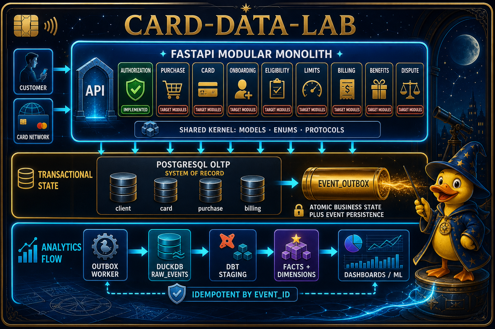

The project keeps one deployable application while preserving boundaries that can be extracted later. The transactional outbox bridges operational correctness and analytical reproducibility.

## Overview

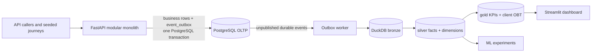

### Implementation map

| Capability | Implemented today | Primary location | Next evolution |
|---|---|---|---|
| HTTP runtime | `/health` and purchase authorization endpoint | `services/main.py`, `services/modules/authorization/` | Mount onboarding, eligibility, limits, card, billing, benefits, and dispute modules. |
| Domain contracts | Pydantic models, enums, protocols, ten event types, versioned envelope | `core/`, `services/shared/` | Normalize the API and simulator purchase-event identity contract. |
| Operational store | Context schemas, constraints, business tables, transactional outbox | `oltp/migrations/001_initial_schema.sql` | Add lifecycle/history tables and richer state transitions. |
| Simulator | Seeded clients, historical calendar dates, fraud/decline controls, one- and six-month commands | `simulator/run.py` | Deliver G7 bulk profiles, cohorts, checkpoints, and the 150k-customer scale run. |
| Lake ingestion | Bronze initialization, idempotent export, bounded backfill, reconciliation | `worker/outbox_to_duckdb.py` | Add lease/retry and export-audit records for concurrent production-style operation. |
| Warehouse | Physical bronze, silver, and gold DuckDB tables; five KPIs and a client OBT | `warehouse/` | Add `dim_card`, invoice/payment facts, and event-backed limit utilization. |
| Products | KPI dashboard and baseline ML experiments | `dashboard/`, `data_products/`, `ml/` | Add CI dashboard smoke coverage and retain only ML models that beat explicit baselines. |

The detailed gate tracker, scale-simulation plan, and dependencies live in [EXECUTION_PLAN.md](EXECUTION_PLAN.md).

## Quick start and operations

The project uses [uv](https://docs.astral.sh/uv/) for a locked Python environment and Taskipy for repeatable workflows. The executable [setup_project.sh](setup_project.sh) syncs dependencies, starts PostgreSQL, waits for readiness, applies migrations, initializes DuckDB bronze, builds dbt layers, then starts Streamlit.

```bash
# Complete local bootstrap; Streamlit remains in the foreground.
uv run task setup

# Bootstrap everything but keep the terminal available.
START_DASHBOARD=0 uv run task setup
```

### Daily operating workflows

| Step | Command | Why it exists |
|---|---|---|
| Start infrastructure | `uv run task infra` | Runs PostgreSQL on `localhost:5433` and Portainer locally. |
| Apply OLTP schema | `uv run task migrate` | Applies idempotent SQL migrations before services or simulation write data. |
| Initialize the lake | `uv run task lake-init` | Creates `bronze.raw_events`, allowing dbt to build before the first event arrives. |
| Generate a small journey | `uv run task pipeline-sample` | Runs simulator → outbox backfill → warehouse refresh for a quick local slice. |
| Generate six months | `uv run task pipeline-6m` | Seeds 1,000 synthetic customers across six calendar months, then publishes the result. |
| Export and rebuild | `uv run task warehouse-refresh` | Drains all unpublished outbox batches, then materializes bronze, silver, and gold. |
| Start dashboard | `uv run task dashboard` | Opens the read-only Streamlit KPI product against `lake/events.duckdb`. |
| Verify the system | `uv run task verify` | Runs the project suite and warehouse assertions. |

For a manual sequence:

```bash
uv run task infra
uv run task migrate
uv run task lake-init
uv run task simulate-6m
uv run task lake-backfill
uv run task dbt-build
uv run task dashboard
```

DuckDB permits one writer. Run `simulate` → `lake-backfill` → `dbt-build` sequentially, and close any DuckDB CLI before writing `lake/events.duckdb`. The dashboard reads `lake/events.duckdb` by default; set `DASHBOARD_DB_PATH` to inspect another compatible lake file.

### Visualize local infrastructure

#### Portainer: containers, health, and logs

Start the infrastructure, then open [https://localhost:9443](https://localhost:9443). On first use, Portainer asks for a local administrator account and an environment; select the local Docker environment. A browser may warn about the local development certificate.

| What to inspect | Where in Portainer | What “good” looks like |
|---|---|---|
| PostgreSQL status | **Containers** → `cardlab-postgres` | Running and healthy. |
| PostgreSQL startup or failures | `cardlab-postgres` → **Logs** | “database system is ready to accept connections”; constraint errors during negative tests are expected test evidence. |
| Portainer status | **Containers** → `cardlab-portainer` | Running. |
| Persistent storage | **Volumes** → `pgdata`, `portainer_data` | Volumes exist across container restarts. |

Portainer has access to the local Docker socket, so treat its administrator account as infrastructure access. Keep it on a trusted local machine; do not expose the mapped ports to an untrusted network.

#### DBeaver: PostgreSQL and DuckDB data

Create two DBeaver connections—one for operational PostgreSQL and one for the analytical DuckDB file.

| Connection | Driver / target | Settings |
|---|---|---|
| OLTP PostgreSQL | **PostgreSQL** | Host `localhost`, port `5433`, database `cardlab`, user `cardlab`, password `cardlab`. |
| Analytics DuckDB | **DuckDB** | Open the local file [`lake/events.duckdb`](lake/events.duckdb). Enable read-only mode if available. |

In PostgreSQL, expand schemas such as `client`, `card`, `purchase`, and `billing`, then inspect `event_outbox` to see the durable handoff. In DuckDB, expand `bronze`, `silver`, and `gold` to follow the warehouse progression.

```sql
-- PostgreSQL: event-stream volume and publication state
select event_type, count(*) as events, count(published_at) as published
from event_outbox
group by 1
order by events desc;
```

```sql
-- DuckDB: physical warehouse relations
select table_schema, table_name
from information_schema.tables
where table_schema in ('bronze', 'silver', 'gold')
order by 1, 2;
```

Use DBeaver for read-only exploration while workflows are running. Disconnect its DuckDB session before `lake-backfill`, `warehouse-refresh`, or `dbt-build`; otherwise DuckDB can reject the writer with a file-lock error.

## Credit-card journey and services

The current runtime proves the authorization slice end to end. The broader lifecycle is the domain target and is progressively emitted by the simulator.

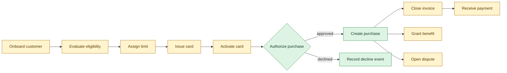

### Authorization request path

```mermaid
sequenceDiagram
    actor Caller
    participant API as FastAPI router
    participant Service as Authorization service
    participant PG as PostgreSQL
    participant Outbox as event_outbox

    Caller->>API: POST /api/purchases/authorize
    API->>Service: card_id + amount + merchant + channel
    Service->>PG: read card status
    alt card is active
        Service->>PG: insert authorization and purchase
        Service->>Outbox: purchase.authorized
        Service-->>API: approved + authorization_id
    else card is absent or inactive
        Service->>Outbox: purchase.declined
        Service-->>API: declined + reason
    end
    Note over PG,Outbox: One transaction; a failed outbox write rolls back business state.
```

### Runtime layers and code structure

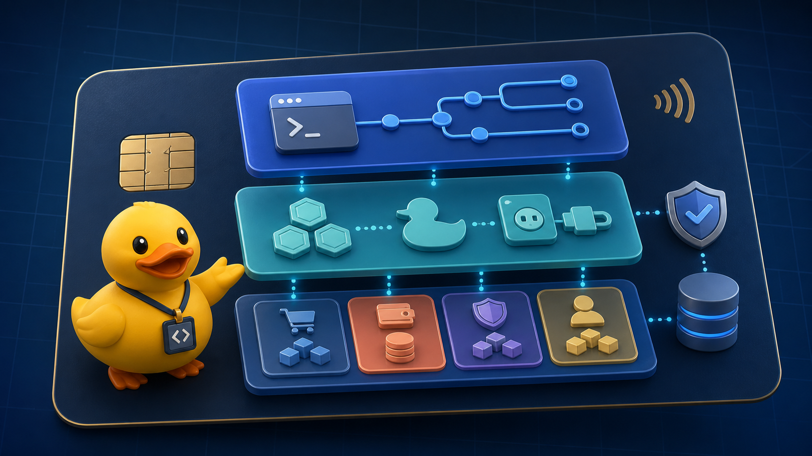

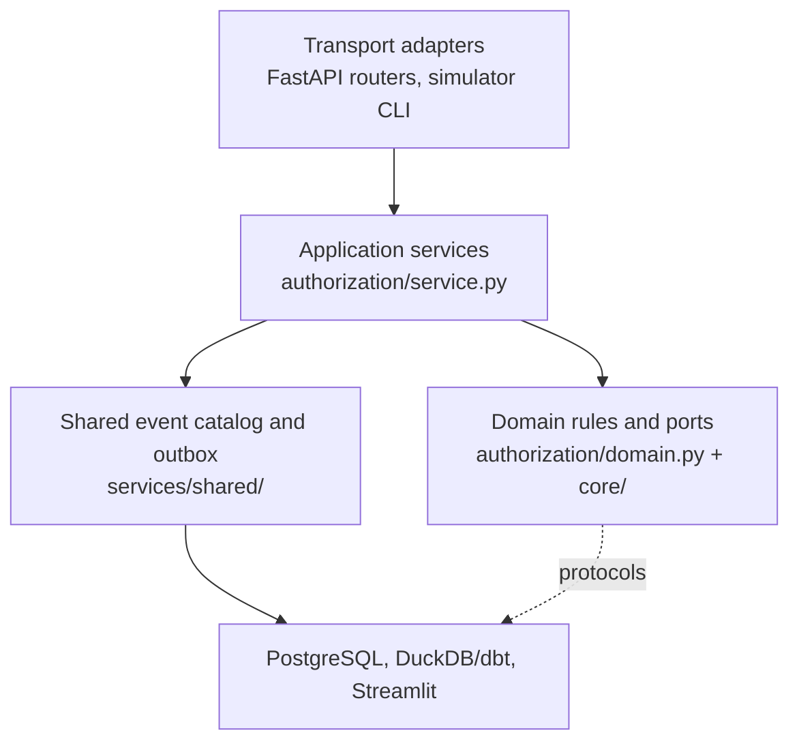

```text
card-data-lab/
├── core/                       # shared domain models, enums, protocols
├── services/
│   ├── main.py                 # FastAPI entry point and router registration
│   ├── shared/                 # event envelope, event catalog, outbox writer
│   └── modules/authorization/  # router, current service, port-driven domain rules
├── oltp/                       # PostgreSQL migrations and connection/migration runner
├── simulator/run.py            # reproducible historical customer journeys
├── worker/outbox_to_duckdb.py  # bronze initialization, export, backfill, reconciliation
├── warehouse/                  # dbt bronze, silver, gold models and assertions
├── dashboard/app.py            # Streamlit KPI reader
├── data_products/ and ml/      # baseline and experimental analytical products
├── docs/images/architecture/   # portfolio architecture assets used in this README
├── learn-diary/                # execution and modelling notes
└── setup_project.sh            # complete local operational bootstrap
```

The authorization module has two complementary shapes. `service.py` is the mounted PostgreSQL-backed use case that demonstrates the atomic transaction. `domain.py` expresses the same rule boundary through repository and publisher protocols, making future extraction and isolated rule testing possible without claiming every context is already a service.

## C4 architecture

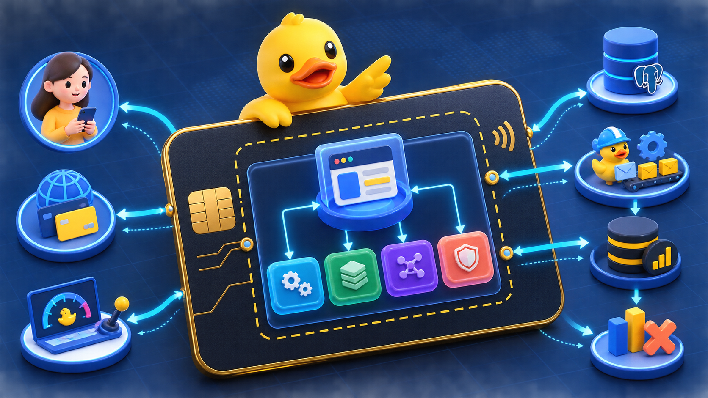

### System context

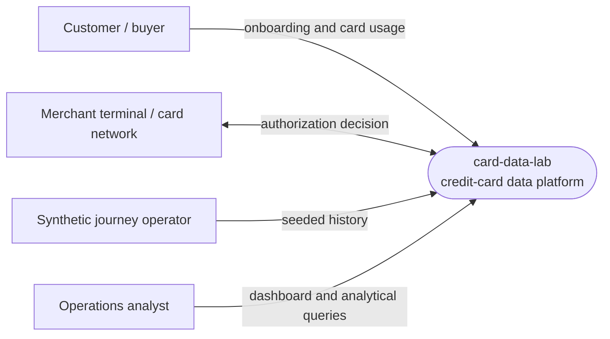

### Containers

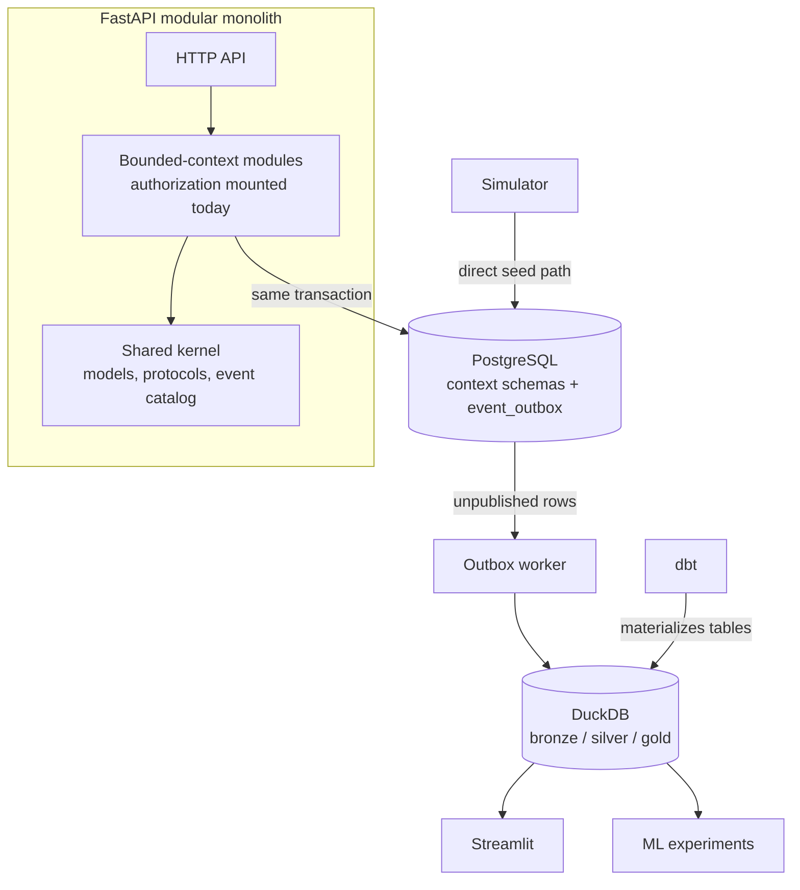

### Authorization components

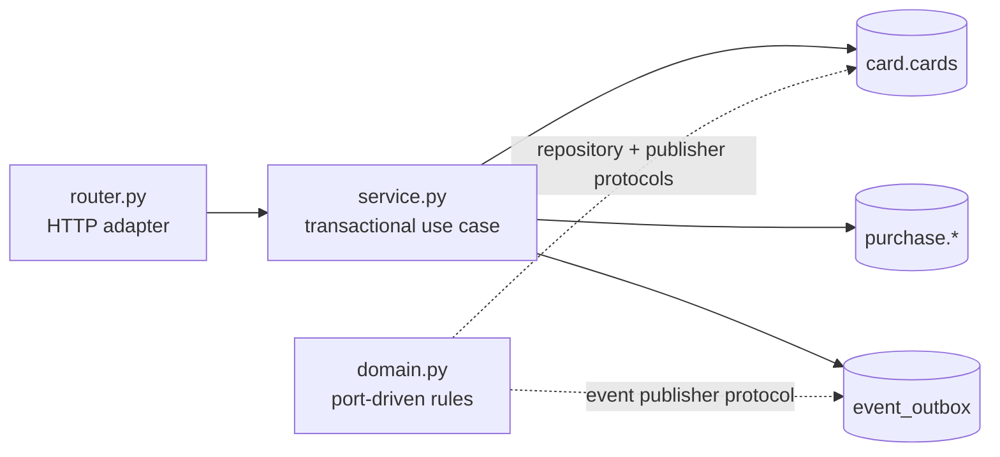

## Information flow


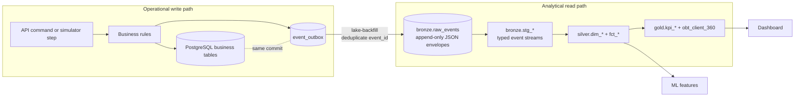

Each envelope carries `event_id`, `event_type`, event timestamp/date, `aggregate_id`, schema version, trace metadata, and typed JSON payload. `event_id` is the idempotency key; `schema_version` makes consumer evolution explicit; the raw event remains available for traceability.

> **Open contract:** simulator purchase events use `aggregate_id = client_id` and carry `card_id` in the payload because the warehouse needs client-level relationships. The mounted API currently uses card ID as the aggregate. Normalize this before mixing both producers in production-like facts.

## Data model

### Operational model

| PostgreSQL schema | Current tables | Responsibility |
|---|---|---|
| `client` | `clients` | Customer identity and basic segment/income/age attributes. |
| `eligibility` | `policies`, `decisions` | Versioned eligibility rules and decisions. |
| `limits` | `credit_limits` | Assigned limits and model provenance. |
| `card` | `cards` | Customer card ownership, product, and status. |
| `purchase` | `authorizations`, `purchases` | Authorization decisions and approved purchase rows. |
| `billing` | `invoices`, `payments` | Invoice closure and payments. |
| `benefits` | `benefits` | Granted benefit programs and points. |
| shared | `event_outbox` | Durable event handoff committed with business state. |

The migration is the source of truth: [001_initial_schema.sql](oltp/migrations/001_initial_schema.sql). It enforces primary/foreign keys, positive amounts, valid card states, valid purchase channels, and one purchase per authorization.

### Analytical model

The warehouse is organised as an event-driven Kimball-style bus. The matrix focuses only on business processes, their conformed dimensions, the declared grain, and delivery status.

### Bus matrix

| Business process / fact | Conformed dimensions | Grain | Status |
|---|---|---|---|
| Customer onboarding → `dim_client` | Client, date | One row per client version; currently one current version per onboarded client. | implemented |
| Purchase attempt → `fct_purchases` | Client, date, card* | One row per authorized or declined purchase event. | implemented |
| Approved authorization → `fct_authorizations` | Client, date, card* | One row per approved purchase event. | implemented |
| Card lifecycle → `dim_card` SCD2 | Client, date, card | One row per card version and validity range. | planned |
| Limit assignment → limit fact | Client, date, card where applicable | One row per assigned or changed credit limit. | planned |
| Invoice closure → invoice fact | Client, date, card where applicable | One row per closed invoice. | planned |
| Payment received → payment fact | Client, date, invoice | One row per payment transaction. | planned |

`*` Card is currently a degenerate attribute extracted from purchase payload JSON. It becomes a conformed dimension only after card lifecycle events and `dim_card` are implemented.

### Entity-relationship diagrams

#### Operational ERD — PostgreSQL

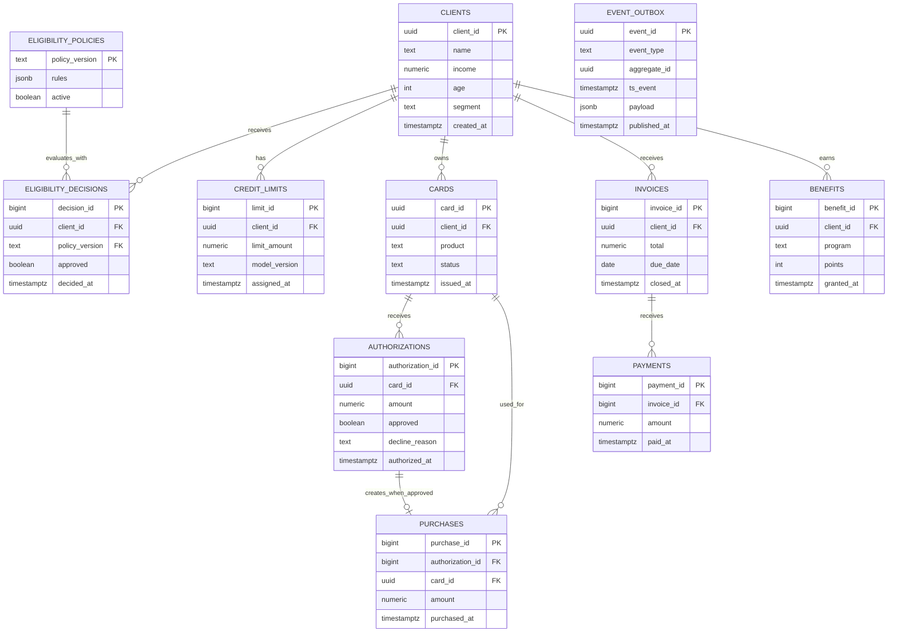

`event_outbox.aggregate_id` is intentionally polymorphic: it can refer to a client, card, or invoice depending on `event_type`, so the database does not enforce a single foreign key for it. The event envelope and producer contract provide that meaning.

#### Analytical ERD — DuckDB

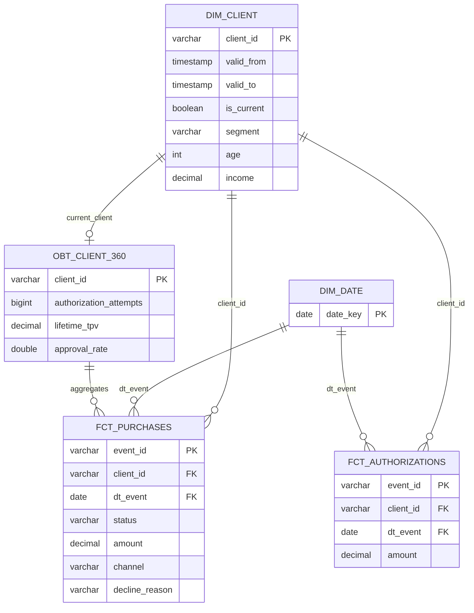

The analytical ERD shows logical modelling relationships. The implemented dbt relationship tests enforce fact-to-client integrity; date relationships are conformed by event date and do not currently have physical DuckDB foreign-key constraints. Gold KPI tables are derived aggregates from these silver relations, so they are documented in the gold-product rules rather than as transactional ERD entities.

The layer responsibilities remain:

| Layer | Physical relations | Rule |
|---|---|---|
| Bronze | `raw_events`, `stg_onboarding_events`, `stg_purchase_events` | Retain the event envelope, then type only the fields required downstream. |
| Silver | `dim_client`, `dim_date`, `fct_purchases`, `fct_authorizations` | Publish reusable conformed dimensions and atomic facts with a declared grain. |
| Gold | five `kpi_*` tables and `obt_client_360` | Publish dashboard- or portfolio-ready products; do not make gold a new source for core facts. |

### Gold products: KPI rules

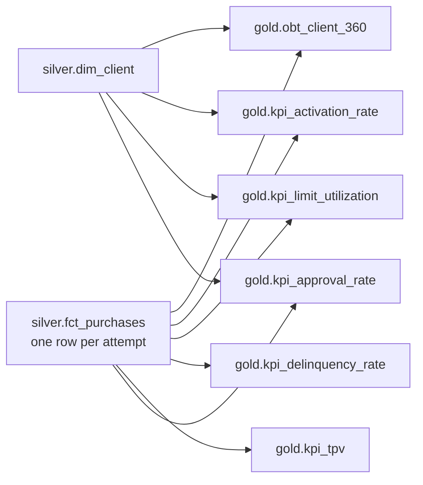

| Gold model | Grain | Rule / formula | Aggregation rule and caveat |
|---|---|---|---|
| `kpi_approval_rate` | day × client segment | `approved_attempts / all_attempts` | The ratio is non-additive. Aggregate `approved` and `attempts`, then divide; never average or sum row-level rates. |
| `kpi_tpv` | day × channel | `sum(amount)` for approved attempts | `tpv` and `tx_count` are additive across dates/channels. `avg_ticket` is non-additive and must be recomputed from amount/count. |
| `kpi_delinquency_rate` | day × decline reason | `limit_exceeded_declines / all_declines` | A financial-stress proxy, not invoice delinquency. At this grain, the `limit_exceeded` row is 1 and other-reason rows are 0; calculate an overall daily proxy from summed numerator and denominator across reason rows. |
| `kpi_limit_utilization` | day × client segment | approved spend divided by income-based daily capacity | Capacity uses the lab rule `income × 30% ÷ 30`, not an assigned credit limit. The current SQL sums capacity across approved purchase rows, so it is purchase-frequency weighted; values above 1 indicate stress but are not a true account-limit ratio. |
| `kpi_activation_rate` | onboarding cohort day × segment | clients with a first approved purchase within seven days / onboarded clients | Cohort metric, not a calendar activity metric. Keep `activated_clients` and `onboarded_clients`; the ratio is non-additive. |

All current proxy KPIs must be replaced or redefined when invoice, payment, and assigned-limit events are available in silver. Their numerator and denominator columns are retained precisely so downstream consumers can re-aggregate safely.

### Gold product: `obt_client_360`

`gold.obt_client_360` is a one-big-table for portfolio exploration, feature prototyping, and client-level analysis. Its grain is **one row per current client**; it is not a transaction fact and must never be joined to `fct_purchases` without preserving that grain.

| Field group | Columns | Rule |
|---|---|---|
| Client identity and profile | `client_id`, `segment`, `age`, `income`, `client_since`, `is_current` | Taken from the current `silver.dim_client` version. |
| Decision activity | `authorization_attempts`, `approved_attempts`, `declined_attempts`, `approval_rate` | Counts all purchase attempts; approval rate is null for a client with zero attempts. |
| Spending behavior | `lifetime_tpv`, `avg_approved_ticket`, `first_purchase_date`, `last_purchase_date`, `active_days` | Uses approved amounts for TPV/ticket; clients with no purchases remain in the OBT through the left join. |
| Capacity proxies | `estimated_credit_capacity`, `lifetime_capacity_utilization` | Capacity is `income × 30%`; utilization compares lifetime TPV to that proxy and is not a real revolving-credit utilization measure. |

The OBT intentionally denormalizes current profile and aggregate behavior. It is appropriate for a customer portfolio table or ML feature starting point; for daily trends, channel analysis, or accurate billing exposure, use the atomic silver facts and appropriately grained gold KPIs instead.

Model grain, SCD2 rules, additivity, and future fact design are documented in [learn-diary/data_modelling.md](learn-diary/data_modelling.md).

## System design

### Functional requirements

| Requirement | Implementation status | Design response |
|---|---|---|
| Authorize or decline a card purchase | Implemented | The FastAPI authorization service checks card state, persists the decision, and emits an event atomically. |
| Preserve a durable analytical event stream | Implemented | Every transactional decision shares a commit with `event_outbox`; the worker exports it to bronze. |
| Generate repeatable historical data | Implemented for local scenarios | The simulator accepts seed and date range; `simulate-6m` distributes events across calendar months. |
| Publish business-facing measures | Implemented | dbt materializes gold KPI tables and a client 360 OBT consumed by Streamlit. |
| Support a full credit-card lifecycle | Planned | Event types and OLTP schemas exist; routers/services and complete event producers remain staged. |
| Generate a 150k-customer / 100k-events-per-day portfolio | Planned as G7 | The execution plan specifies profiles, cohorts, checkpointing, bulk persistence, and a progressive load ladder. |

### Non-functional requirements

| Concern | Current mechanism | Remaining work |
|---|---|---|
| Transactional consistency | Business rows and outbox event commit together. | Extend this boundary consistently to every new context. |
| Delivery safety | `event_id` deduplication and bounded backfill make exports idempotent. | Add lease/retry coordination and audit records. |
| Reproducibility | `uv.lock`, Taskipy commands, seeded simulator, explicit date windows. | Add run manifests and configuration hashes for scale runs. |
| Data quality | dbt schema/relationship/SCD2 assertions and explicit model grain. | Add payment, limit, and card-history assertions as their facts arrive. |
| Operability | `setup_project.sh`, Taskipy workflows, local Docker Compose. | Add CI execution and capacity telemetry. |
| Local security | Synthetic data only; dashboard uses read-only DuckDB. | Keep generated profiles non-PII and avoid exposing local ports beyond intended use. |

### Key trade-offs

| Decision | Benefit | Cost / mitigation |
|---|---|---|
| Modular monolith instead of microservices | Simple local runtime and one atomic transaction boundary. | Module contracts must stay explicit so later extraction remains possible. |
| PostgreSQL outbox instead of direct analytical writes | OLTP remains source of truth; retries are safe. | Adds export latency and requires sequential DuckDB writer operation. |
| DuckDB as a local warehouse | Low operational overhead and portable analytical file. | One writer at a time; workflow commands enforce sequential writes. |
| dbt physical tables | Fast, inspectable dashboard reads and clear bronze/silver/gold ownership. | Refresh is an explicit operational step after export. |
| Synthetic profiles | Safe experimentation and controllable distributions. | Realism must be improved with cohorts, calendar effects, and scale gates. |

### Roadmap to implementation

| Priority | Work package | Outcome |
|---:|---|---|
| 1 | Normalize purchase-event aggregate and payload contract | API and simulator events join consistently to client/card dimensions. |
| 2 | Execute G7.0–G7.4 | Enriched profiles, calendar journeys, bulk generation, checkpoints, and a six-month high-volume portfolio. |
| 3 | Add card and billing event producers | `dim_card` SCD2 plus payment, invoice, and limit facts replace KPI proxies. |
| 4 | Harden outbox operations | Lease/retry behavior, export audit, and CI-operated workflow checks. |
| 5 | Mature data products | Dashboard smoke checks and ML models retained only when they beat their baselines. |

For tasks, dependencies, gates, and what can safely run in parallel, use [EXECUTION_PLAN.md](EXECUTION_PLAN.md) rather than duplicating project tracking here.

## Learn diary

- [Execution guide](learn-diary/execute_project.md) — prerequisites, Taskipy commands, workflows, and troubleshooting.
- [Data modelling notes](learn-diary/data_modelling.md) — bus matrix, facts, dimensions, SCD2, additivity, and KPI design.
- [dbt learning guide](learn-diary/dbt_learning.md) — sources, refs, materializations, tests, macros, and DuckDB workflows in this repository.
- [uv and Taskipy learning guide](learn-diary/uv_taskipy_learning.md) — project setup, lockfiles, environments, dependency groups, and operational task composition.
- [Execution plan](EXECUTION_PLAN.md) — implementation gates, scale-simulation board, and dependency graph.
