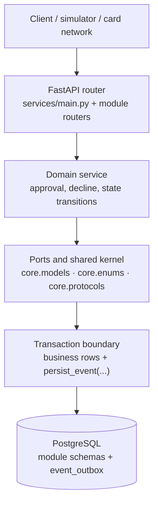
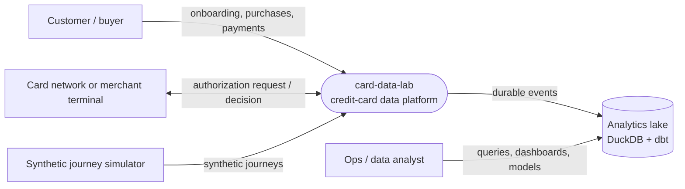
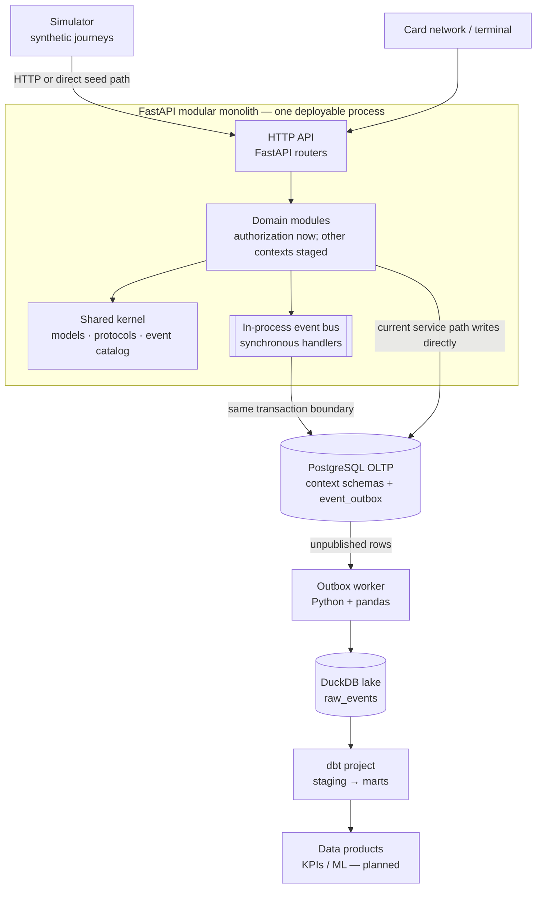
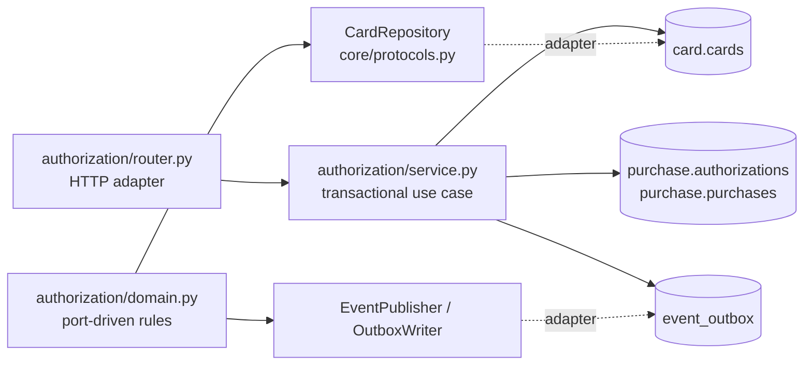
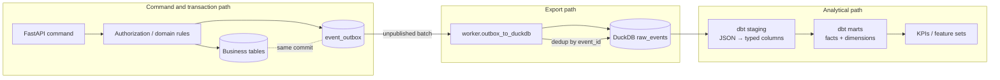

# card-data-lab

`card-data-lab` is a credit-card data platform lab: a FastAPI modular monolith owns the transactional journey, PostgreSQL stores OLTP state and durable events, and DuckDB/dbt turns those events into analytical models.

The project is deliberately staged. The current working slice is purchase authorization, the transactional outbox, synthetic journey generation, the DuckDB lake worker, dbt staging, and the first marts. The wider credit-card domain is documented as the target architecture and execution plan.


## At a glance


```text
synthetic journeys / API
          │
          ▼
FastAPI modular monolith ── atomic business rows + event_outbox ── PostgreSQL
          │                                                          │
          └──────────────────────────────────────────────────────────┘
                                                                     ▼
                                                     outbox worker + pandas
                                                                     │
                                                                     ▼
                                                         DuckDB raw_events
                                                                     │
                                                                     ▼
                                                     dbt staging → marts
                                                                     │
                                                   dashboards / ML (planned)
```

The key architectural choice is a modular monolith: bounded contexts are separated in code and PostgreSQL schemas, but run in one FastAPI process. Events are the integration contract, and the outbox makes the transactional database the source of truth for the analytics stream.

## Current implementation status

| Area | What is implemented now | Next architectural slice |
|---|---|---|
| Runtime | `/health` and `POST /api/purchases/authorize` | Add routers and services for onboarding, eligibility, limits, card, billing, benefits, and disputes |
| Domain | Shared Pydantic models, enums, protocols, event envelope, and authorization rules | Wire every bounded context through the same ports and event contracts |
| OLTP | PostgreSQL schemas for client, eligibility, limits, card, purchase, billing, benefits, plus `event_outbox` | Add missing history tables and richer workflow state as contexts grow |
| Events | Ten typed event payloads and transactional outbox persistence | Add consumers, schema compatibility checks, and event-driven module handlers |
| Simulation | Synthetic clients, active cards, approved/declined purchases, fraud and decline knobs | Replay the full onboarding → eligibility → limit → card lifecycle |
| Lake | Idempotent `event_outbox` → DuckDB `raw_events` worker with reconciliation helper | Production-style scheduling, partition maintenance, and stronger retry/lease handling |
| Warehouse | dbt staging plus `dim_client`, `dim_date`, `fct_purchases`, and `fct_authorizations` | Complete SCD2 dimensions, payments/limits facts, and KPI marts |
| Products | Data-product design documented | Build five tested KPI models and a credit-limit/risk baseline |

For the execution tracker and gates, see [EXECUTION_PLAN.md](EXECUTION_PLAN.md). The plan contains the detailed work breakdown; this README explains the architecture that the work produces.

## Quick start

The project uses [uv](https://docs.astral.sh/uv/) for the locked Python environment and taskipy for repeatable commands.

```bash
uv sync
uv run task infra                 # PostgreSQL + Portainer
uv run task migrate               # apply idempotent OLTP DDL
uv run task test-unit             # fast tests, no database required
uv run task test-fast             # schemas + database + service tests
uv run task api                   # FastAPI on the local machine
```

End-to-end data path:

```bash
uv run task infra
uv run task migrate
uv run task simulate               # seed synthetic clients and purchase events
uv run task lake                   # event_outbox → lake/events.duckdb
uv run task dbt-build               # staging + marts in the DuckDB file
uv run task dbt-test
```

PostgreSQL is exposed on host port `5433` by [docker-compose.yml](docker-compose.yml). The defaults are `cardlab/cardlab/cardlab`; override `PGHOST`, `PGPORT`, `PGUSER`, `PGPASSWORD`, and `PGDATABASE` when needed.

## 1. Code structure


### Runtime layers



The current authorization request is wired through `services/modules/authorization/router.py` to `service.py`. The `domain.py` file contains the more extractable ports-and-adapters form of the same business rules and is covered by in-memory protocol tests. This gives the project a clear migration path without pretending that every future module is already mounted in the API.

### Repository layout

```text
card-data-lab/
├── core/
│   ├── enums.py                         # domain vocabulary and literals
│   ├── models.py                        # shared Pydantic domain models
│   └── protocols.py                     # repository, authorizer, publisher ports
├── services/
│   ├── main.py                          # FastAPI app and router registration
│   ├── shared/
│   │   ├── events.py                    # BaseEvent and EventHeader
│   │   ├── catalog.py                   # 10 event types and payload models
│   │   └── outbox.py                    # transactional writer and in-process bus
│   └── modules/
│       └── authorization/
│           ├── router.py                 # HTTP adapter
│           ├── service.py                # current PostgreSQL-backed use case
│           └── domain.py                 # port-driven business-rule variant
├── oltp/
│   ├── migrations/001_initial_schema.sql # schemas, tables, constraints, outbox
│   └── run_migrations.py                 # idempotent migration runner
├── simulator/run.py                     # synthetic client and purchase journeys
├── worker/outbox_to_duckdb.py           # PostgreSQL outbox → DuckDB raw_events
├── warehouse/
│   ├── models/staging/                  # typed event views
│   ├── models/marts/                    # first facts and dimensions
│   └── tests/                           # SCD2 and warehouse assertions
├── tests/                               # unit, DB, API, simulator, lake tests
├── docs/images/architecture/            # README architecture illustrations
├── pyproject.toml                       # dependencies and taskipy commands
└── uv.lock                              # reproducible dependency resolution
```

### Module boundary rules

The target module shape is:

```text
services/modules/<context>/
├── router.py       # transport adapter
├── service.py      # application use cases
├── domain.py       # pure business rules where useful
├── repository.py   # context-owned persistence adapter
├── schemas.py      # request/response contracts
└── events.py       # context event constructors
```

The rules are more important than the exact filenames:

1. A context owns its tables and invariants.
2. A context does not join another context’s tables directly.
3. Cross-context integration uses typed events and the shared event envelope.
4. Infrastructure dependencies are injected behind protocols when the domain needs to be unit-testable or extractable.
5. The API transaction commits business state and its outbox event together.

### Current authorization path

```mermaid
sequenceDiagram
    actor Caller
    participant API as FastAPI router
    participant SVC as Authorization service
    participant PG as PostgreSQL
    participant O as event_outbox

    Caller->>API: POST /api/purchases/authorize
    API->>SVC: card_id + amount + merchant + channel
    SVC->>PG: read card status
    alt card missing or not active
        SVC->>O: purchase.declined
        SVC-->>API: approved=false + reason
    else active card
        SVC->>PG: insert authorization and purchase
        SVC->>O: purchase.authorized
        SVC-->>API: approved=true + authorization_id
    end
    Note over PG,O: One database transaction; rollback removes both sides.
```

## 2. C4 architecture


### Level 1 — System context



The system boundary is the platform, not the database. PostgreSQL is the operational store inside the platform; DuckDB/dbt is the analytical read path fed by durable events.

### Level 2 — Containers



#### Container responsibilities

| Container | Responsibility | Durable contract |
|---|---|---|
| FastAPI app | Accept commands and execute domain use cases | HTTP request/response schemas |
| Shared kernel | Stable vocabulary, models, protocols, event payloads | Python/Pydantic contracts |
| PostgreSQL | Transactional state, constraints, and event handoff | SQL tables + `event_outbox` |
| Outbox worker | Batch, deduplicate, and export events | `event_id` idempotency key |
| DuckDB | Local analytical lake and dbt target | `raw_events` append-only table |
| dbt | Type/rename events and build facts/dimensions | model SQL + schema tests |
| Simulator | Produce repeatable synthetic signal | function parameters and seeded RNG |

### Level 3 — Component view: authorization



The two paths are complementary: `service.py` is the currently wired application adapter that proves atomic database behavior; `domain.py` demonstrates how the business rules can be isolated behind `CardRepository` and `EventPublisher` ports for unit tests and future extraction.

### Target bounded contexts

The event catalog and OLTP migration define the wider domain vocabulary even though only authorization currently has a mounted router:

```text
Onboarding → Eligibility → Limits → Card → Purchase → Authorization
                                                     ├→ Benefits
                                                     ├→ Billing / Invoices / Payments
                                                     └→ Dispute
```

These are target boundaries, not claims that all of those modules are already implemented.

## 3. Information flow


### Operational-to-analytical flow



### Step-by-step flow

1. A caller sends a purchase authorization command to the FastAPI router.
2. The authorization service reads `card.cards` and applies the current rule: the card must exist and be `active`.
3. An approved request inserts `purchase.authorizations` and `purchase.purchases`; a declined request records the decline event without purchase rows.
4. The service creates a typed `BaseEvent` with `event_id`, `event_type`, `ts_event`, `dt_event`, `aggregate_id`, versioned headers, and JSON payload.
5. The business rows and `event_outbox` row are committed in one PostgreSQL transaction. If the event write fails, the business rows roll back too.
6. `worker/outbox_to_duckdb.py` reads unpublished rows in timestamp order, creates `raw_events` if needed, and prevents duplicate lake rows using `event_id`.
7. Successfully handled outbox rows receive `published_at`; `reconcile()` compares published outbox rows with lake rows.
8. dbt filters the raw event stream into typed staging models, then builds facts and dimensions in the same DuckDB file.
9. Future dashboards and ML models consume marts rather than reaching back into the OLTP database.

### Event envelope

Every event uses the same transport shape:

| Field | Meaning |
|---|---|
| `event_id` | Unique idempotency key; UUIDv7 when the runtime provides it, UUID4 fallback otherwise |
| `event_type` | Stable name such as `purchase.authorized` |
| `ts_event` / `dt_event` | Event timestamp and date partition key |
| `aggregate_id` | Client, card, or invoice identity associated with the event |
| `header` | `trace_id`, `source_service`, and `schema_version` |
| `payload` | JSON business data validated by a typed Pydantic model before persistence |

The current catalog contains ten event types:

| Event | Producer | Aggregate |
|---|---|---|
| `customer.onboarded` | onboarding | client |
| `eligibility.evaluated` | eligibility | client |
| `limit.assigned` | limits | client |
| `card.issued` | card | card |
| `card.activated` | card | card |
| `purchase.authorized` | authorization | card |
| `purchase.declined` | authorization | card |
| `invoice.closed` | invoices | client |
| `payment.received` | payments | invoice |
| `benefit.granted` | benefits | client |

### Reliability properties

- **Atomic handoff:** business mutations and the outbox insert share one PostgreSQL transaction.
- **At-least-once export safety:** a worker retry does not create a second `raw_events` row for the same `event_id`.
- **Schema evolution:** `schema_version` travels with every event; consumers can evolve independently.
- **Traceability:** `trace_id`, source service, event time, aggregate identity, and raw JSON are retained.
- **Reconciliation:** outbox and lake counts can be compared after each export pass.
- **Test isolation:** database-backed tests create their own events and clean their own outbox scope.

## 4. Data model

### PostgreSQL OLTP schemas

The migration in [oltp/migrations/001_initial_schema.sql](oltp/migrations/001_initial_schema.sql) is the source of truth for current tables.

| Schema | Tables | Purpose |
|---|---|---|
| `client` | `clients` | customer identity and basic properties |
| `eligibility` | `policies`, `decisions` | policy versions and decisions |
| `limits` | `credit_limits` | assigned credit limits and model version |
| `card` | `cards` | card ownership, product, and status |
| `purchase` | `authorizations`, `purchases` | decision history and approved purchase rows |
| `billing` | `invoices`, `payments` | invoice closure and payment transactions |
| `benefits` | `benefits` | granted programs and points |
| shared | `event_outbox` | durable integration stream for the lake |

Important database invariants include positive monetary values, valid card states, valid purchase channels, foreign keys from transactions to their aggregates, and one purchase per authorization.

### DuckDB/dbt models

The warehouse currently reads `main.raw_events` from `lake/events.duckdb`.

| Model | Current grain | Meaning |
|---|---|---|
| `stg_onboarding_events` | one row per `customer.onboarded` event | typed onboarding stream |
| `stg_purchase_events` | one row per authorized or declined purchase event | normalized purchase stream |
| `dim_client` | one row per onboarded client version | SCD2-shaped client dimension; one current row today |
| `dim_date` | one row per event date present | calendar attributes |
| `fct_purchases` | one row per purchase attempt | approved and declined attempts |
| `fct_authorizations` | one row per approved authorization event | current approved subset of the purchase stream |

The next warehouse slice should make `fct_authorizations` a complete authorization-attempt fact and keep `fct_purchases` restricted to successful purchases if that distinction is desired. Until then, the SQL and schema descriptions above are the authoritative current behavior.

For the intended Kimball design, grain rules, conformed dimensions, SCD2 validity, and KPI definitions, see [learn-diary/data_modelling.md](learn-diary/data_modelling.md).

## 5. Execution plan and parallel work

The critical path is:

```text
Stage 0 → Stage 1 → (Stage 2A ∥ Stage 2B) → Stage 3 → Stage 4 → Stage 5 → (Stage 6A ∥ Stage 6B)
```

| Stage | Deliverable | Gate |
|---|---|---|
| 0 — Environment | uv, Docker, taskipy, repository scaffold | environment and commands work |
| 1 — Contracts | event catalog, Pydantic payloads, OLTP DDL, database constraints | schemas validate and migration is repeatable |
| 2A — Service | purchase → authorization → business rows + outbox | API decisions and rollback behavior pass |
| 2B — Simulator | seeded synthetic clients and monthly purchase journeys | volume, fraud, and decline knobs produce signal |
| 3 — Lake | outbox worker, deduplication, reconciliation | reruns do not duplicate and counts reconcile |
| 4 — Staging | dbt source contract and typed staging views | build and `not_null`/`unique` tests pass |
| 5 — Marts | purchase/auth facts, client/date dimensions, SCD2 checks | grain, relationships, and validity checks pass |
| 6A — Products | approval, TPV, delinquency, utilization, activation KPIs | each metric has a test |
| 6B — ML | limit/risk baseline from warehouse features | holdout beats a naive baseline |

Stages 2A and 2B can run in parallel because both depend on the event contracts and meet at `event_outbox`. Stages 6A and 6B can run in parallel because both consume read-only marts.

The operational details, gate criteria, and tracker live in [EXECUTION_PLAN.md](EXECUTION_PLAN.md). The commands and troubleshooting notes live in [learn-diary/execute_project.md](learn-diary/execute_project.md).

## 6. Tests and quality gates

```bash
UV_CACHE_DIR=/tmp/cardlab-uv-cache uv run pytest -q -m unit
UV_CACHE_DIR=/tmp/cardlab-uv-cache uv run task test-fast
UV_CACHE_DIR=/tmp/cardlab-uv-cache uv run task test-all-ordered
UV_CACHE_DIR=/tmp/cardlab-uv-cache uv run task dbt-build
UV_CACHE_DIR=/tmp/cardlab-uv-cache uv run task dbt-test
```

The test suite is layered:

- `unit`: core models, protocols, event schemas, and pure authorization rules; no PostgreSQL required.
- `db`: migrations, constraints, service behavior, and transactional outbox behavior; requires the Docker PostgreSQL service.
- `slow`: simulator volume and lake integration checks.

`test-fast` is the everyday feedback loop. `test-all-ordered` runs the deterministic layers from cheap to expensive before a push. If PostgreSQL is unavailable, the DB-marked suites are skipped by `tests/conftest.py`; start the infrastructure when you need those checks to execute.

Current verification snapshot: `pytest -q -m unit` passes 25 tests. The dbt project parses and creates all six models, but the checked-in lake data still needs a warehouse-quality pass: relationship tests find purchase events without matching `dim_client` rows, and the custom SCD2 assertion currently refers to `event_id` while `dim_client` exposes `onboarded_event_id`. Those are data/test alignment follow-ups for Stage 5, not changes to the runtime architecture described above.

## 7. Local tooling

```bash
uv run task infra       # PostgreSQL on localhost:5433, Portainer on localhost:9443
uv run task infra-down
```

Portainer is useful for container status and logs. DBeaver can connect to PostgreSQL with `localhost:5433` and to the DuckDB file at `lake/events.duckdb`.

Useful checks:

```sql
-- PostgreSQL
SELECT event_type, count(*)
FROM event_outbox
GROUP BY 1
ORDER BY 2 DESC;
```

```sql
-- DuckDB
SELECT event_type, count(*) AS events
FROM raw_events
GROUP BY 1
ORDER BY 2 DESC;
```

## 8. Roadmap

1. Complete the full module set and mount its routers behind the same FastAPI application.
2. Move the API path toward the port-driven domain implementation while keeping transaction ownership explicit.
3. Expand the simulator so onboarding, eligibility, limits, card activation, billing, payments, benefits, and disputes emit realistic event sequences.
4. Harden the worker for concurrent runs, retry leases, and explicit export audit records.
5. Complete facts and SCD2 dimensions, then add tested KPI marts.
6. Add a reproducible feature pipeline and baseline credit-limit/risk model.

## Learn diary

- [Execution guide](learn-diary/execute_project.md) — prerequisites, tasks, workflows, and troubleshooting.
- [Data modelling notes](learn-diary/data_modelling.md) — bus matrix, grain, fact types, SCD2, additivity, and KPI design.
- [Execution plan](EXECUTION_PLAN.md) — detailed stages, gates, dependencies, and parallel tracks.
