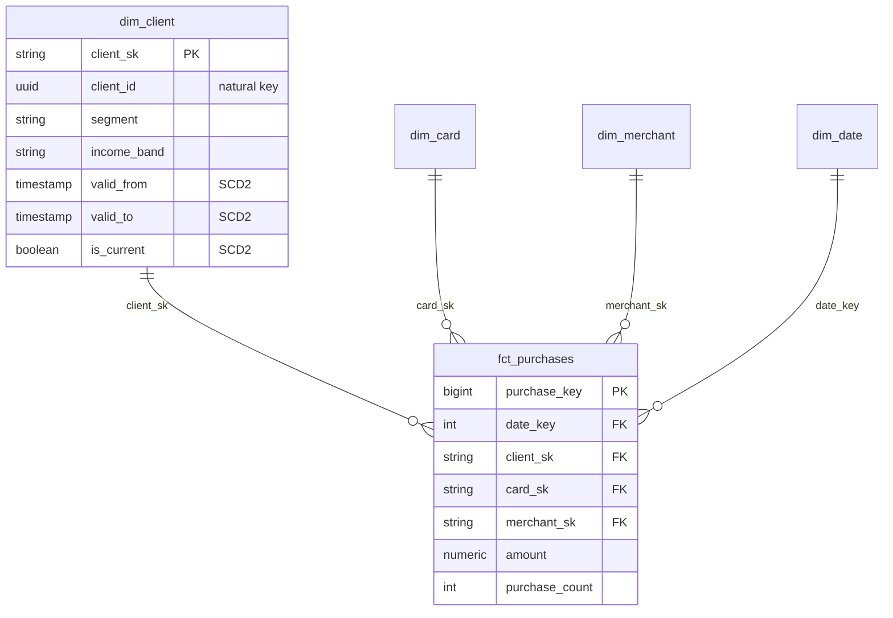
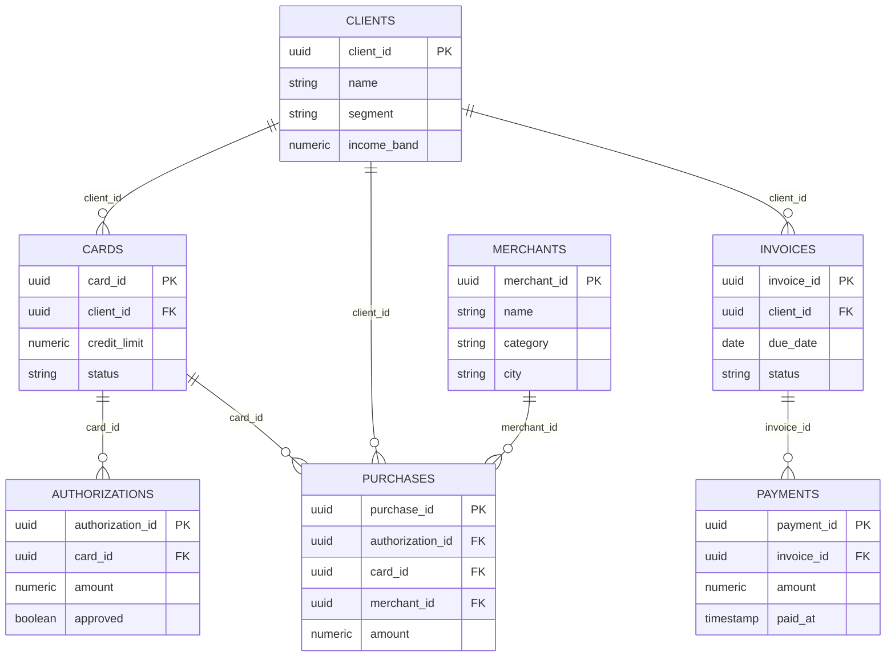

# Data Modelling — Deep Study Notes

> Companion to `README.md` (Data Model section) and `EXECUTION_PLAN.md` (Stages 4–5).
> Everything here is grounded in our credit card lab: examples reference `fct_purchases`, `dim_client`, etc.

---

## 1. The Four-Step Dimensional Design Process (Kimball)

Design a star schema in this exact order — each step constrains the next:

| Step | Question | Our answer (credit card lab) |
|---|---|---|
| 1. Select the business process | What *activity* generates events? | Purchase authorization, payment, limit assignment |
| 2. Declare the grain | What exactly is **one row** in the fact? | One row = one authorization attempt |
| 3. Identify the dimensions | What *descriptive context* do we slice by? | client, card, merchant, date |
| 4. Determine the facts | What *measures* do we aggregate? | amount, count, approval flag |

**Why order matters**: if you pick dimensions before grain, you get mixed-grain facts ("chameleon facts") that produce wrong counts when summed. Grain is the contract of the table.

---

## 2. Bus Matrix

The bus matrix is the master plan of the warehouse: **rows = business processes (facts), columns = dimensions**. Each ✅ means the dimension applies to that fact.

### Our lab's bus matrix

| Business process / Fact | dim_date | dim_client | dim_card | dim_merchant |
|---|---|---|---|---|
| `fct_authorizations` (auth attempts) | ✅ | ✅ | ✅ | ✅ |
| `fct_purchases` (authorized purchases) | ✅ | ✅ | ✅ | ✅ |
| `fct_payments` (invoice payments) | ✅ | ✅ | ❌ | ❌ |
| `fct_limit_changes` (limit assignments) | ✅ | ✅ | ❌ | ❌ |

### How to read it

- **Columns with many ✅ are conformed dimensions** — `dim_date` and `dim_client` are shared across all processes, so a drill-across report ("approval rate vs. delinquency rate, by client segment") is valid because both facts use the *same* dimension keys.
- **Rows define the data mosaic**: each row is one star schema; together they cover the business.
- **Gaps matter too**: `fct_payments` has no merchant → you cannot ask "which merchants drive late payments" without redesigning.

### Practical rules we follow

1. Build the bus matrix **before** writing any dbt model.
2. A dimension reused across ≥ 2 facts must be **conformed**: same primary key (`client_sk`), same attributes, same SCD strategy.
3. In dbt, enforce conformity by generating dimensions once in `marts/` and referencing them from every fact.

```text
staging/            → 1:1 with sources
marts/facts/        → fct_* models
marts/dimensions/   → dim_* models (single source for every fact)
```

---

## 3. Star Schema Anatomy



**Key conventions**

- Fact PK: surrogate key or natural composite; FKs to dimensions only.
- Dimension PK: surrogate key (`client_sk`) — *never* the natural key (`client_id`) when SCD2 is used, otherwise history collapses.
- Facts contain **numbers and keys only** — no descriptive text (that belongs in dimensions).

---

## 4. Choosing the Grain — Worked Examples

Grain statement template: *"One row in `<fact>` represents one `<thing>` at `<moment/per period>`."*

| Fact | Grain statement | Test that proves it |
|---|---|---|
| `fct_authorizations` | one row per **authorization attempt** | `count(*) == count(distinct authorization_id)` |
| `fct_purchases` | one row per **authorized purchase** | every row joins exactly 1 approved auth |
| `fct_payments` | one row per **payment transaction** | sum(amount) reconciles with billing.payments |
| `fct_limit_changes` | one row per **limit assignment event** | no duplicate (client_id, assigned_at) |

**Common grain mistakes**

- Mixing approved + declined purchases into `fct_purchases` → TPV inflated. Declines belong in `fct_authorizations`.
- Daily snapshot rows mixed with transaction rows → double counting.
- Adding a "monthly total" column to a transaction-grain fact → semi-additive confusion.

---

## 5. Types of Facts

| Type | Definition | Example in our lab |
|---|---|---|
| **Transaction** | One row per event; never changes after insert | `fct_purchases`, `fct_authorizations` |
| **Periodic snapshot** | One row per entity per fixed period | monthly client balance snapshot |
| **Accumulating snapshot** | One row per workflow, updated as milestones complete | onboarding pipeline (requested → verified → approved → card issued) |
| **Factless fact** | Only keys, no measures | `fct_card_activations` (did activation happen on date X) |
| **Aggregate** | Pre-summarized atomic fact | daily TPV per merchant |

### Additivity — the rule that decides how measures can be aggregated

| Additivity | Meaning | Example measure | Valid aggregation |
|---|---|---|---|
| **Fully additive** | Sum across all dimensions | `amount` in purchases | SUM over time, client, merchant ✓ |
| **Semi-additive** | Sum over some dimensions only | account balance | SUM over clients ✓, over time ✗ (use last value) |
| **Non-additive** | Never sum | ratios, percentages | recompute from numerator/denominator |

Our KPIs respect this:

- `tpv` = SUM(amount) → fully additive ✓
- `approval_rate` = approved_count / attempts → **non-additive**: store the two counts, compute the ratio at query time. Never store the ratio as a fact column and average it.
- `delinquency_rate` = overdue_invoices / closed_invoices → same pattern.

---

## 6. SCD Type 2 (Slowly Changing Dimension)

Client properties change (income band, segment). We need to know *"what was the client's segment **at purchase time**?"* — not today's value. That's SCD2.

### Mechanics

On attribute change, **don't UPDATE** the row. Insert a new version:

| client_sk | client_id | segment | income_band | valid_from | valid_to | is_current |
|---|---|---|---|---|---|---|
| c-sk-1 | cli-42 | basic | low | 2026-01-01 | 2026-05-31 | false |
| c-sk-2 | cli-42 | premium | high | 2026-06-01 | ∞ (null) | true |

- The fact stores `client_sk` → joins resolve to the **correct historical version** automatically.
- `valid_to` of the old row = `valid_from` of the new row (half-open interval `[from, to)`).

### dbt snapshot implementation (what we use)

```sql


-- dbt snapshot strategies:
--   check:   hash of tracked columns changed?
--   timestamp: updated_at column moved?
```

Then `dim_client` selects from the snapshot where `dbt_valid_to is null` for current view, or exposes full history.

### Quality gates for SCD2 (Gate G5)

1. **No overlaps**: for each `client_id`, intervals `[valid_from, valid_to)` never intersect.
2. **No gaps**: previous `valid_to` == next `valid_from`.
3. **Exactly one current row** per natural key (`is_current = true` count == 1).
4. **Facts never join on natural key** — test `relationships` from fact to dim surrogate key.

```sql
-- overlap check (must return 0 rows)
select client_id
from dim_client a
join dim_client b using (client_id)
where a.client_sk < b.client_sk
  and a.valid_from < b.valid_to
  and b.valid_from < a.valid_to;
```

### Other SCD types (know why we reject them)

| Type | Technique | Why not here |
|---|---|---|
| 0 | Never change | fine for dim_date |
| 1 | Overwrite | loses history → can't analyze churn by old segment |
| 2 | New row + validity range | ✅ our choice for client/card |
| 3 | Previous-value column | only 1 level of history |
| 4 | Mini-dimension | overkill for lab scale; use when dims have fast-changing *numerical* attrs |
| 6 | 1+2+3 hybrid | complexity not justified yet |

---

## 7. KPI Metrics — From Facts to Dashboards

Each KPI = **one dbt model + one test** (Stage 6A). Define: name, formula, grain, source fact, additivity.

| KPI | Formula | Source | Grain | Notes |
|---|---|---|---|---|
| Approval rate | approved / attempts | `fct_authorizations` | per day × segment | non-additive → keep counts |
| TPV | Σ amount (approved) | `fct_purchases` | per day | fully additive |
| Delinquency rate | invoices overdue / closed | `fct_payments` + `billing.invoices` | per month | compare due_date vs paid_at |
| Limit utilization | Σ purchases / Σ limit | `fct_purchases` + `fct_limit_changes` | per month × client | watch SCD2 join timing |
| Activation rate | activated cards / issued cards | `card.cards` events | per cohort week | factless-fact style |

### Metric design rules

1. **Atomic first**: build KPIs on atomic facts; aggregates are caches, not sources of truth.
2. **Numerator/denominator pattern**: store counts separately; ratios computed in the model layer.
3. **Time alignment**: delinquency needs `due_date` (dim_date role) not `payment_date`. Use *role-playing dimensions* (two views of dim_date).
4. **Cohort semantics**: activation rate uses issue-week cohort, not calendar month — mixing them hides funnel drop-off.
5. **Test every KPI**: e.g., `approval_rate between 0 and 1`, `accepted_values` on segment, reconciliation tests (Σ mart = Σ staging).

### Example KPI model skeleton

```sql
-- marts/kpis/kpi_approval_rate.sql
select
    d.date_key,
    c.segment,
    count(*)                                        as attempts,
    count(*) filter (where f.approved)              as approved,
    count(*) filter (where f.approved) * 1.0
        / nullif(count(*), 0)                       as approval_rate
from {{ ref('fct_authorizations') }} f
join {{ ref('dim_date') }} d   on d.date_key = f.date_key
join {{ ref('dim_client') }} c on c.client_sk = f.client_sk
group by 1, 2
```

---

## 8. Cheat Sheet — Decision Checklist

Before declaring any fact model done:

- [ ] Grain stated in the model's schema.yml description
- [ ] Uniqueness test on the grain key passes
- [ ] All FKs have `relationships` tests to conformed dimensions
- [ ] Measures classified as additive / semi-additive / non-additive
- [ ] Ratios stored as numerator+denominator, computed at query time
- [ ] Dimensions checked against the bus matrix (conformed keys)
- [ ] SCD2 dims pass overlap/gap/single-current-row tests
- [ ] Row-count reconciliation vs staging source

---

# Part II — Deep Dive

> Advanced material: late-arriving data, degenerate dimensions, role-playing, bridge tables, incremental strategies, and the modeling decisions that bite you in production.

---

## 9. Degenerate Dimensions

A **degenerate dimension** is a dimension key stored in the fact with no corresponding dim table — it exists only to identify the transaction.

In our lab:

| Fact | Degenerate dimension | Why no dim table? |
|---|---|---|
| `fct_authorizations` | `authorization_id` | No attributes; pure identifier from the auth event |
| `fct_purchases` | `authorization_id` (inherited) + `purchase_id` | Traceability back to the source OLTP row |

**Why keep them?**

1. **Uniqueness tests**: our grain test (`count(*) == count(distinct authorization_id)`) depends on having the key in the fact.
2. **Drill-through**: "show me the raw auth rows behind this approval-rate dip" — the analyst pivots from aggregate to atomic using the degenerate key.
3. **Reconciliation**: Σ mart vs. staging joins on the natural key.

**Rule of thumb**: if a key has ≥ 3–4 descriptive attributes, promote it to a real dimension; otherwise leave it degenerate.

---

## 10. Role-Playing Dimensions

The same dimension joined to a fact multiple times under different aliases. Classic case: dates.

`fct_payments` needs *three* date perspectives:

```sql
-- marts/facts/fct_payments.sql
select
    p.payment_id,
    d_due.date_key      as due_date_key,     -- role: due
    d_paid.date_key     as paid_date_key,    -- role: paid
    d_post.date_key     as posting_date_key, -- role: posting
    ...
from staging_payments p
left join {{ ref('dim_date') }} d_due   on d_due.date_day = p.due_date::date
left join {{ ref('dim_date') }} d_paid  on d_paid.date_day = p.paid_at::date
left join {{ ref('dim_date') }} d_post  on d_post.date_day = p.posted_at::date
```

In dbt, expose views per role:

```sql
-- marts/dimensions/dim_date_due.sql
select * from {{ ref('dim_date') }}
```

and document each view in schema.yml so BI tools show "Due Date" / "Paid Date" as separate entities.

**Delinquency rate depends on this**: comparing `due_date` to `paid_at` through the *same* conformed `dim_date` is what makes month-over-month delinquency comparable. If you used free-form timestamps instead, fiscal calendars/holidays would silently skew buckets.

---

## 11. Late-Arriving Facts & Late-Arriving Dimensions

### Late-arriving facts

An authorization event arrives at the lake *after* its client's SCD2 version changed. Naive join on `is_current = true` attaches the purchase to the wrong segment.

Mitigations, in order of preference:

1. **Lookup at load time by timestamp**: join the fact's `event_ts` against `[valid_from, valid_to)` instead of `is_current`:

```sql
join dim_client c
  on c.client_id = f.client_id
 and f.event_ts >= c.valid_from
 and (c.valid_to is null or f.event_ts < c.valid_to)
```

2. **"Unknown" member**: every dimension gets a `-1` row (`client_sk = -1`, segment = `'UNKNOWN'`). Facts that can't resolve get `-1`; a nightly backfill job re-resolves them.
3. **Never**: store the attribute value directly in the fact ("snapshot facts") — this duplicates the dimension and breaks conformity.

### Late-arriving dimensions

The fact arrives before the client record exists (e.g., simulator emits events out of order). Same solution: the `-1` unknown member plus a backfill sweep keyed on the natural key + event timestamp.

---

## 12. Bridge Tables (Many-to-Many)

Facts assume one FK value per dimension row. When reality is many-to-many, use a **bridge**.

Lab example: a merchant can belong to multiple merchant groups (acquirer group + category group). Options:

| Approach | How | Trade-off |
|---|---|---|
| Bridge table | `bridge_merchant_group(merchant_sk, group_sk, weight_allocation)` | Flexible; requires weighted allocation for additive measures |
| Flattened dim | denormalize groups into `dim_merchant` columns | Simple; breaks when N groups grows |
| Multi-valued fact keys | one fact row per group | ⚠️ double-counts TPV unless divided |

Weighted allocation rule: measures flowing through a bridge must be multiplied by `weight_allocation`, and Σ weights per parent must equal 1.0 — add a dbt test for exactly that.

For our lab scale we flatten into `dim_merchant` and note the bridge as the escape hatch.

---

## 13. Surrogate Keys — Generation Strategies

How do we actually build `client_sk`?

| Strategy | Example | Pros | Cons |
|---|---|---|---|
| Hash of natural key + valid_from | `md5(client_id \|\| valid_from)` | Deterministic, idempotent re-runs, no sequence state | Wider keys; hash collisions theoretical |
| DB sequence | `nextval('client_sk_seq')` | Compact ints | Not idempotent across full refreshes |
| Row number in model | `row_number() over (...)` | Pure SQL | Unstable ordering → sk churn between runs |

We use **hash-based surrogate keys** (`dbt_utils.generate_surrogate_key(['client_id', 'valid_from'])`) because:

- Re-running the model produces identical keys → incremental merges are safe.
- Keys are stable across environments (dev/prod parity for tests).
- No coordination with OLTP sequences.

Gotcha: hash the *typed* values consistently (nulls, casing). A `null` income band hashing differently between staging and mart silently splits dimension rows.

---

## 14. Incremental Models vs. Snapshots vs. Full Refresh

| Concern | dbt snapshot | Incremental fact | Full refresh |
|---|---|---|---|
| Use for | SCD2 dimensions | Append-only facts | Small dims (dim_date) |
| Idempotent? | Yes (merge on PK) | Yes (with unique_key) | Yes |
| Handles updates? | Yes — detects changes | Only via delete+insert window | Yes |
| Cost at scale | Medium | Low | High |

Our pattern:

- `dim_client` ← snapshot (check strategy on `segment`, `income_band`)
- `fct_authorizations`, `fct_purchases` ← incremental append with `unique_key = authorization_id`, filter `where event_ts > (select max(event_ts) from {{ this }})`
- `dim_date` ← full refresh (tiny, static)

**Late-data safety net**: an incremental lookback window (`interval '3 days'`) reprocesses recent partitions so out-of-order lake arrivals self-heal:

```sql

where event_ts >= (select coalesce(max(event_ts), '1970-01-01') from {{ this }}) - interval '3 days'

```

---

## 15. Testing Strategy Beyond Basic dbt Tests

Layered tests, cheapest first:

1. **Schema contracts** (`dbt contract`): enforce column names/types at model boundaries — catches upstream drift at compile time.
2. **Generic tests**: `unique`, `not_null`, `accepted_values`, `relationships`.
3. **Singular tests** (custom SQL):
   - SCD2 overlap/gap/single-current (from §6)
   - Grain reconciliation: `count(*)` mart == `count(*)` staging filtered to approved
   - Additivity invariant: `Σ amount` in KPI model == `Σ amount` in fact for same filter
4. **Business-invariant tests**:
   - Every approved authorization has ≤ 1 purchase (funnel can't create purchases from thin air)
   - `amount > 0` for purchases; declines have `amount` but never enter `fct_purchases`
   - `valid_to > valid_from` everywhere in SCD2 dims

Example singular test:

```sql
-- tests/assert_no_purchase_without_approved_auth.sql
select p.purchase_id
from {{ ref('fct_purchases') }} p
left join {{ ref('fct_authorizations') }} a
       on a.authorization_id = p.authorization_id
      and a.approved
where a.authorization_id is null
```

---

## 16. Anti-Patterns Catalog (What Breaks Star Schemas)

| Anti-pattern | Symptom | Fix |
|---|---|---|
| Chameleon fact | Same table serves two grains; counts don't reconcile | Split into two facts, declare grain each |
| Overloaded fact | Descriptive text columns in fact | Move attributes to dims |
| Snowflaking | `dim_merchant → dim_city → dim_region` chains | Flatten into the dim (denormalize); Kimball prefers wide dims |
| Ratio stored as column | Averaged ratios give nonsense | Store numerator/denominator (§5) |
| Natural-key joins to SCD2 dims | History collapses to current row | Join on surrogate key only |
| ODS-as-mart | Analysts query staging tables | Conform everything through marts; staging is private |
| Silent type coercion | `amount` as float loses cents | Use `numeric(12,2)` end-to-end; contract-enforce it |

---

## 17. Worked Exercise — Adding a New Business Process

Scenario: we now want to track **chargebacks**. Apply the four steps:

1. **Process**: chargeback lifecycle (dispute opened → resolved).
2. **Grain**: one row per chargeback event? Or accumulating snapshot per dispute?
   → Choose **transaction grain** (`fct_chargebacks`, one row per chargeback event) + optional accumulating snapshot later.
3. **Dimensions**: extend bus matrix — `dim_date` ✅, `dim_client` ✅, `dim_card` ✅, `dim_merchant` ✅, new `dim_chargeback_reason` (small, static, Type 0).
4. **Facts**: `chargeback_amount` (fully additive), `is_fraudulent` flag, counts.

Checklist consequences:
- New bus matrix row sharing all four conformed dims → drill-across with purchases works immediately.
- New accepted-values list for `reason_code` in schema.yml.
- Reconciliation test vs. OLTP `disputes` table.

This exercise is the proof the bus matrix pays off: **no existing model changes**, only additions.

---

## 18. From OLTP (3NF) to Analytics — Why Two Different Models?

Our lab has **two databases with two modeling philosophies**:

| | OLTP (`postgres`, `oltp/migrations/`) | Lake / analytics (`lake/`, DuckDB) |
|---|---|---|
| Purpose | Run the business *now* | Answer questions about the past |
| Model | **3NF** — normalized entities, no redundancy | **Star schema** — denormalized dims + facts |
| Writes | Many small INSERTs/UPDATEs, strict ACID | Bulk appends, mostly immutable events |
| Reads | Point lookups by key ("this client's card") | Full-table scans, aggregations over millions of rows |
| Schema changes | Feared — migrations, backfills | Cheap — add a column to a dim and rebuild |

### What 3NF looks like in our OLTP



Each entity lives in its own table; attributes are stored **exactly once**. A purchase row holds only `merchant_id` — the merchant's name, city, category live in `merchants`. That's the point of normalization: **one fact, one place** → updates can't create inconsistencies.

### Why we don't just query 3NF directly for analytics

1. **Join explosion**: "TPV by merchant category per month" touches `purchases → cards → clients → merchants → categories`. Five-way joins on every dashboard refresh, recomputed every time.
2. **No history**: 3NF is a *snapshot of now*. When a client moves from `basic` to `premium`, we UPDATE the row — last quarter's segment attribution is gone. Analytics needs SCD2 history (§6), which OLTP actively destroys.
3. **Wrong workload**: analytical queries scan 100% of rows; OLTP engines are tuned for selective index lookups. Running heavy aggregates degrades authorization latency — the most latency-critical path in our system.
4. **Semantic mismatch**: analysts want measures and conformed dimensions, not entity relationships. The star schema *is* the analyst's mental model.
5. **Coupling risk**: if dashboards read production tables, any schema migration breaks BI. The lake decouples them: OLTP evolves freely, marts stay stable.

### Event modelling: the bridge between the two

The outbox pattern (`services/shared/outbox.py` → `worker/outbox_to_duckdb.py`) turns OLTP state changes into an **event stream** — append-only records like:

```json
{ "event_type": "authorization.approved",
  "occurred_at": "...", "client_id": "...", "amount": 250.00 }
```

Events are the natural raw material for analytics because they are:

- **Immutable & append-only** → perfect incremental loads (§14), replayable, auditable.
- **Time-stamped at occurrence** → SCD2 joins resolve correctly even for late arrivals (§11).
- **Grain-explicit by construction** → one event = one business moment, which maps 1:1 onto transaction-grain facts (§4).

The transformation pipeline is then:

```text
OLTP 3NF (state)  --outbox-->  event stream (immutable facts)
      --worker-->  lake (raw events)
      --dbt-->     staging → star schema (facts + SCD2 dims) → KPIs
```

```mermaid
flowchart LR
    subgraph OLTP["OLTP — Postgres (3NF, current state)"]
        A[(clients / cards /
merchants / invoices)]
        O[(outbox events)]
        A -- "service writes state + event
atomically" --> O
    end
    subgraph STREAM["Event stream — Kafka-style topic"]
        T[[topic: authorization.approved
payment.settled · limit.assigned]]
    end
    subgraph LAKE["Lake — DuckDB"]
        R[(raw_events)]
        S{{staging models}}
        F[(fct_* facts)]
        D{{dim_* dims (SCD2)}}
        K{{KPI marts}}
    end
    W[worker/
outbox_to_duckdb]
    O -- poll/emit --> T
    T -- consume --> W
    W -- append --> R
    R --> S
    S --> F
    S --> D
    F --> K
    D --> K
```

### Mapping Kafka events onto Kimball concepts

An event stream is not a modeling paradigm of its own — it is **raw material that must land somewhere in the bus matrix**. Each event type maps to a Kimball construct:

| Event concept | Kimball equivalent | Our lab example |
|---|---|---|
| Event type (`authorization.approved`) | Business process → one fact table row family | `fct_authorizations` vs `fct_purchases` split by outcome |
| One event occurrence | Grain declaration: one row per event | one row per auth attempt (§4) |
| Event payload measures | Facts (additive measures) | `amount`, `approved` flag |
| Payload identifiers | Degenerate dimensions (§9) | `authorization_id`, `purchase_id` |
| Referenced entities in payload | FK to conformed dimensions | `client_id`, `card_id`, `merchant_id` → dim lookups at load time |
| `occurred_at` | Role-playing date/time keys (§10) | event date key; also drives SCD2 `[valid_from, valid_to)` resolution (§11) |
| Entity-state events (`limit.assigned`, `client.updated`) | Dimension change feed → snapshot/SCD2 processing | dbt snapshot detects attribute changes from these events |
| Out-of-order / replayed events | Late-arriving facts (§11) | lookback window + `-1` unknown member backfill |
| Topic partition ordering | Not a warehouse concern — model on `occurred_at`, not arrival order | idempotent upsert on event id |

**Design rule**: the *topic* is a transport detail; the *event schema* is a contract. Model the warehouse against the event contract, never against topic names or partition layout — otherwise re-partitioning or renaming topics breaks marts.

**Anti-pattern**: creating one fact table per Kafka topic blindly. Topics are deployment units; business processes are analytical units. First place every event type on the bus matrix (§2), then group events into facts by grain — two topics can feed one fact, and one topic can feed two.

### The key insight

> **3NF optimizes for writes and consistency of *current state*; dimensional models optimize for reads and analysis of *history*.** Neither is wrong — they answer different questions. The event log is the bridge: it captures state changes as immutable facts at the source, so the warehouse never has to guess what happened or when.

Rule of thumb: normalize where data **changes**, denormalize where data is **queried**.

---

## References

- Kimball & Ross, *The Data Warehouse Toolkit* (3rd ed.) — ch. 1–4 (bus matrix, grains, fact types), ch. 5 (SCD), ch. 8 (late-arriving data), ch. 13 (bridges)
- dbt docs: Snapshots (`dbt snapshot`), incremental models, model contracts, tests
- dbt-utils: `generate_surrogate_key`
