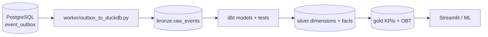
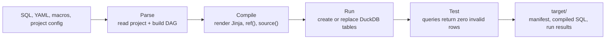
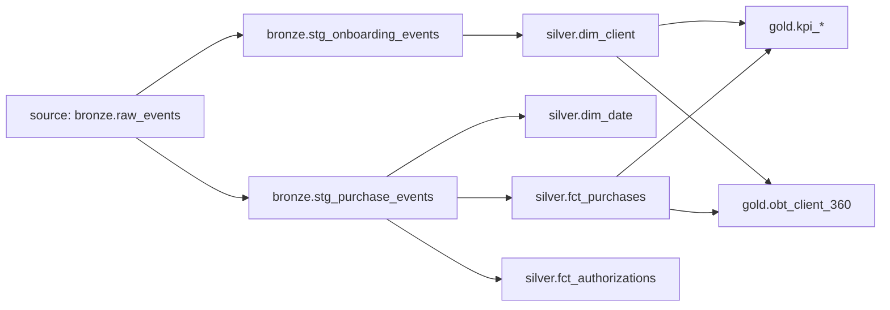
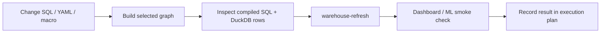

# dbt learning guide — card-data-lab

This guide explains dbt through the warehouse in this repository. It is a companion to [data_modelling.md](data_modelling.md): that diary explains modelling choices; this one explains how dbt turns those choices into repeatable DuckDB tables.

## What dbt does here

dbt is the transformation layer. It does not ingest events from PostgreSQL and it does not serve the dashboard. Those responsibilities stay explicit:



In short:

- The **outbox worker** owns ingestion and appends idempotent raw envelopes.
- **dbt** owns typed staging, dimensional/fact transformations, KPI products, dependencies, and data tests.
- **DuckDB** stores each layer physically in `lake/events.duckdb`.
- **Streamlit** and ML code only read transformed data; they do not query PostgreSQL directly.

## The repository’s dbt project

| File or directory | Purpose |
|---|---|
| [`warehouse/dbt_project.yml`](../warehouse/dbt_project.yml) | Project identity, model paths, materialization, and layer-to-schema configuration. |
| [`warehouse/profiles.yml`](../warehouse/profiles.yml) | Local DuckDB connection: `../lake/events.duckdb`, four dbt threads. |
| [`warehouse/models/staging/`](../warehouse/models/staging) | Bronze source declaration, typed event models, and staging tests. |
| [`warehouse/models/marts/`](../warehouse/models/marts) | Silver dimensions/facts; `marts/kpis/` is configured as gold. |
| [`warehouse/models/gold/`](../warehouse/models/gold) | Gold OBT models. |
| [`warehouse/macros/`](../warehouse/macros) | Reusable dbt Jinja macros and generic tests. |
| [`warehouse/tests/`](../warehouse/tests) | Singular SQL assertions such as SCD2 invariants. |

The project name is `cardlab`; its profile name is also `cardlab`. That match tells dbt which connection configuration to load.

## The dbt lifecycle: parse, compile, run, test

dbt is a compiler and an executor. Understanding the phases makes failures much easier to classify.



| Phase | What dbt does | Typical failure | First place to look |
|---|---|---|---|
| Parse | Reads YAML, model files, macros, and config; builds a directed acyclic graph (DAG). | Duplicate model name, malformed YAML, unknown macro. | The model/YAML file and `dbt ls`. |
| Compile | Resolves Jinja, `ref()`, `source()`, variables, and configs into adapter-specific SQL. | Unknown source/model, invalid Jinja, wrong selected dependency. | `warehouse/target/compiled/` after a run. |
| Run | Executes materializations in dependency order. | DuckDB lock, invalid SQL, missing source table. | Database error and compiled SQL. |
| Test | Executes generic and singular assertion queries. | Unexpected rows violate a contract. | The test SQL and the failing rows—not the test name alone. |

`dbt build` combines run and test in DAG order. It is the safest normal command because it avoids treating a successful table build as a successful warehouse when its contract is failing. `dbt test` checks existing relations only; it does not refresh them.

### Artifacts worth knowing

dbt writes generated artifacts under `warehouse/target/`:

| Artifact | Use |
|---|---|
| `manifest.json` | Complete graph metadata: models, sources, tests, configs, and dependencies. |
| `run_results.json` | Result, duration, and adapter response for the last invocation. |
| `compiled/` | SQL after Jinja, `ref()`, and `source()` resolution; the best debugging view. |
| `graph_summary.json` | Compact graph summary used by dbt tooling. |

These are generated outputs, not the source of truth. Edit SQL, YAML, macros, or project configuration; then rerun dbt.

## Bronze, silver, and gold in this project

| Layer | DuckDB schema | Owner | Contents | Question answered |
|---|---|---|---|---|
| Bronze raw | `bronze` | Outbox worker | `raw_events`, append-only JSON envelopes | “What exactly was exported?” |
| Bronze staging | `bronze` | dbt | `stg_onboarding_events`, `stg_purchase_events` | “What typed event rows can transformations use?” |
| Silver | `silver` | dbt | `dim_client`, `dim_date`, `fct_purchases`, `fct_authorizations` | “What are the conformed dimensions and facts?” |
| Gold | `gold` | dbt | five `kpi_*` models and `obt_client_360` | “What can a dashboard, analyst, or product consume directly?” |

The rule is intentionally simple:

```text
bronze = retain and type events
silver = model reusable business entities and measurable activity
gold   = publish an audience-specific analytical product
```

Do not make a dbt model that writes raw events. `bronze.raw_events` is created and filled by `worker/outbox_to_duckdb.py`; dbt declares it as a source and starts downstream of it.

## How schemas are selected

`dbt_project.yml` applies physical-table materialization to all project models, then maps directories to schemas:

```yaml
models:
  cardlab:
    +materialized: table
    staging:
      +schema: bronze
    marts:
      +schema: silver
      kpis:
        +schema: gold
    gold:
      +schema: gold
```

The macro [`generate_schema_name.sql`](../warehouse/macros/generate_schema_name.sql) is important. dbt normally combines a target schema with a custom schema name. This project overrides that behavior so the configured names are exactly `bronze`, `silver`, and `gold` in DuckDB. Without the macro, a local target can produce names such as `main_bronze`, which breaks the architectural contract and read queries such as `gold.kpi_tpv`.

### Configuration precedence

dbt applies configurations from broad to specific. A more-specific configuration overrides a broader one:

```text
adapter default
  → dbt_project.yml project/package config
    → directory config in dbt_project.yml
      → model-level {{ config(...) }} block
        → command-line flags and target context where applicable
```

For example, the project-wide `+materialized: table` applies to every model unless a model overrides it. The nested `marts.kpis` configuration changes only models in `warehouse/models/marts/kpis/` to the gold schema. Avoid hidden model-level overrides unless the exception has a clear reason and is documented beside the SQL.

## Jinja: dbt SQL before it becomes DuckDB SQL

dbt model files are SQL templates rendered by Jinja. The delimiters have distinct roles:

| Syntax | Meaning | Repository example |
|---|---|---|
| `{{ ... }}` | Evaluate an expression and inject its result into SQL. | `{{ ref('fct_purchases') }}` |
| `` | Control flow or macro definition. | `` |
| `{# ... #}` | Jinja-only comment; removed during compilation. | Useful for explaining template logic. |
| `-- ...` | SQL comment; normally remains in compiled SQL. | Used for model grain comments. |

The `stg_purchase_events` model is a good example of the boundary between templating and SQL: Jinja resolves the source relation, then DuckDB functions parse the JSON payload and cast amount to `decimal(12,2)`.

```sql
from {{ source('lake', 'raw_events') }}
where event_type in ('purchase.authorized', 'purchase.declined')
```

Do not use Jinja when ordinary SQL is clearer. Use it for dbt-specific dependency resolution, repeated SQL patterns, configuration, or controlled generation—not to hide business logic in templates.

## Sources: tell dbt what it does not own

[`models/staging/sources.yml`](../warehouse/models/staging/sources.yml) declares the worker-owned input:

```yaml
sources:
  - name: lake
    schema: bronze
    tables:
      - name: raw_events
```

Models use that declaration with `source()`:

```sql
from {{ source('lake', 'raw_events') }}
```

This is better than hard-coding `bronze.raw_events` in every model because dbt can:

- understand the lineage from source to model;
- test source columns (`unique(event_id)`, `not_null(payload)`, and more);
- keep the physical location in one declarative file;
- display the source in generated documentation and the dependency graph.

## `ref()`: declare model dependencies

Use `ref()` whenever one dbt model depends on another:

```sql
from {{ ref('fct_purchases') }}
```

In [`obt_client_360.sql`](../warehouse/models/gold/obt_client_360.sql), `ref('dim_client')` and `ref('fct_purchases')` build the client OBT from silver models. dbt uses this declaration to order execution correctly and to resolve the right relation name for the active target.

The current lineage is:



### Reading selectors as graph operators

Selectors let you operate on a small, meaningful subgraph instead of rebuilding everything.

| Selector | Meaning | Example use |
|---|---|---|
| `model_name` | That node only. | Test `fct_purchases` after changing its YAML. |
| `+model_name` | Model and all upstream parents. | Build `+obt_client_360` after changing the OBT. |
| `model_name+` | Model and all downstream children. | Rebuild `stg_purchase_events+` after changing event parsing. |
| `+model_name+` | Model, all parents, and all children. | Explore the complete impact of `fct_purchases`. |
| `source:lake.raw_events+` | Source and all descendants. | Rebuild every model fed by raw events. |
| `path:models/gold` | Nodes in a file path. | Build gold-only models during dashboard work. |

Examples:

```bash
uv run dbt --project-dir warehouse --profiles-dir warehouse build --select stg_purchase_events+
uv run dbt --project-dir warehouse --profiles-dir warehouse test --select +obt_client_360
uv run dbt --project-dir warehouse --profiles-dir warehouse ls --select source:lake.raw_events+
```

Use selectors for development; use the complete `warehouse-refresh` workflow before handing data to the dashboard.

## Materializations: table, view, incremental

A materialization defines what dbt creates in the database.

| Materialization | Meaning | Use in this repository |
|---|---|---|
| `table` | Rebuilds a physical table when the model runs. | Current default for every model. It makes dashboard reads simple and inspectable. |
| `view` | Creates a saved query evaluated at read time. | Not used for warehouse layers today. Useful only when data is small or freshness matters more than repeated read cost. |
| `incremental` | Adds/merges only new or changed rows. | Future scale option for very large event histories; it needs an explicit unique key and event-time strategy. |
| `ephemeral` | Inlines SQL into dependent models without creating a relation. | Not used today; useful for small reusable SQL-only transformations. |

The current table strategy is intentionally conservative. It is easy to validate and ideal for the current local workload. At G7 scale, assess incremental staging/facts only after documenting late-arriving events, deduplication, and rebuild behavior.

### Incremental models: the future scale decision

An incremental model is not simply a faster table. It is a correctness design: dbt must know which rows are new or changed, what happens when events arrive late, and how to recover from a bad run.

For `stg_purchase_events`, a future safe design would need all of the following:

| Design question | Candidate answer for this project | Why it must be explicit |
|---|---|---|
| Unique key | `event_id` | The raw worker already treats it as the idempotency key. |
| New-row boundary | `ts_event` plus a reprocessing lookback window | A pure “greater than max timestamp” filter loses late events. |
| Deduplication | Keep one row per `event_id` in the incremental query. | Replayed outbox batches must not duplicate the fact. |
| Update behavior | Rebuild a recent event-time window or merge by unique key. | Payload corrections and late arrivals need a policy. |
| Recovery | Document `--full-refresh` and expected runtime/disk usage. | A broken incremental state must be repairable. |

Do not introduce `is_incremental()` merely because data is growing. First implement the G7 run manifest and late-arrival contract described in the execution plan, then benchmark full-table rebuilds against a documented incremental alternative.

## Tests: executable data contracts

dbt tests are SQL queries that return failing rows. Zero rows means the test passes.

### Generic column tests

Schema YAML files attach reusable tests to a model or source column:

```yaml
columns:
  - name: event_id
    tests: [unique, not_null]
  - name: status
    tests:
      - accepted_values:
          values: ['approved', 'declined']
```

The project uses:

| Test | Example | Protects |
|---|---|---|
| `not_null` | purchase amount, client ID, KPI measure | Required fields are populated. |
| `unique` | event IDs, date keys, OBT client ID | The declared grain is not duplicated. |
| `accepted_values` | purchase status | Domain values stay within the expected vocabulary. |
| `relationships` | fact `client_id` → `dim_client.client_id` | Facts join to their required conformed dimension. |
| `dbt_utils_accepts_range` | approval rate between 0 and 1 | Ratios obey a business-valid range. |

### Custom generic test

[`macros/accepts_range.sql`](../warehouse/macros/accepts_range.sql) defines `dbt_utils_accepts_range`. It is a reusable Jinja test macro used by KPI YAML to reject non-null values outside an inclusive range.

### Singular tests

Files under [`warehouse/tests/`](../warehouse/tests) are singular tests: the SQL itself defines the invariant. For example, `assert_dim_client_one_current_row.sql` fails when a client has anything other than one current SCD2 row.

Use a singular test when the rule spans rows, columns, or models and is clearer as SQL than as a generic YAML test.

### What a failing test really means

A dbt test failure is a query result, not a Python-style assertion message. The correct debugging loop is:

1. Read the test name to identify the model and rule.
2. Open the compiled test SQL or re-create the query from the YAML/macro.
3. Run it manually and inspect the returned rows.
4. Decide whether the producer, transformation, contract, or test assumption is wrong.
5. Fix the source of truth; do not remove a test only to make a build green.

For example, a failed `relationships` test from `fct_purchases.client_id` to `dim_client.client_id` can reveal an event-contract mismatch: a purchase producer used card ID where the warehouse expects client ID. The right fix is normally at the producer contract or normalization layer, not a loose left join that hides the missing dimension.

## Documentation, lineage, and what is not enabled yet

dbt can generate browsable documentation from model/source YAML and its manifest:

```bash
uv run dbt --project-dir warehouse --profiles-dir warehouse docs generate
uv run dbt --project-dir warehouse --profiles-dir warehouse docs serve
```

Document model grain, business definition, owner, and important columns in YAML. dbt docs are most useful when descriptions answer questions that SQL alone cannot: what a row means, whether a measure is additive, and which event contract feeds it.

The following dbt features are **not currently configured** in this repository:

| Feature | What it could add later | Why it is not a current dependency |
|---|---|---|
| Source freshness | Warn when raw events are older than an SLA. | The project has `loaded_at_field` but no declared freshness thresholds or scheduler. |
| Seeds | Small version-controlled CSV lookup data. | Current segment/status vocabularies live in Python/SQL, not reference CSVs. |
| Snapshots | Automated slowly-changing history capture. | `dim_client` is SCD2-shaped through model SQL; true attribute-change event history is not emitted yet. |
| Exposures | Declare dashboard/ML consumers in dbt lineage. | Valuable once dashboard/ML release ownership is formalized. |
| Semantic layer / metrics | Central metric definitions for multiple tools. | Current KPI SQL is intentionally transparent while metric contracts are still evolving. |

Adding a feature should solve a real ownership or correctness problem, not just make the project look more “advanced.”

## Daily commands

Run commands from the repository root:

```bash
# Build models and run their tests in dependency order.
uv run task dbt-build

# Run tests only.
uv run task dbt-test

# Export every queued event first, then rebuild bronze/silver/gold.
uv run task warehouse-refresh

# List the graph or focus on one model while learning.
uv run dbt --project-dir warehouse --profiles-dir warehouse ls
uv run dbt --project-dir warehouse --profiles-dir warehouse build --select +obt_client_360
uv run dbt --project-dir warehouse --profiles-dir warehouse test --select fct_purchases

# Inspect compiled SQL and generate local dbt documentation.
uv run dbt --project-dir warehouse --profiles-dir warehouse compile --select stg_purchase_events
uv run dbt --project-dir warehouse --profiles-dir warehouse docs generate
```

The Taskipy commands run dbt with `warehouse/` as the working directory and `warehouse/profiles.yml` as the profile directory. The longer commands above are useful when selecting models from the repository root.

Before any writer command, close a DuckDB CLI or another writer connected to `lake/events.duckdb`. DuckDB allows one writer, so this sequence is deliberate:

```text
simulate → lake-backfill → dbt-build → dashboard / ML reads
```

### A safe local release workflow



For a warehouse change, do not point Streamlit at a half-built lake. Finish the writer workflow first, then use dashboard/ML as read-only consumers. Keep exploratory notebooks and DuckDB CLI sessions read-only whenever a writer may run.

## How to add a model safely

1. **Choose the layer and grain.** Write a one-sentence grain statement first: for example, “one row per invoice closure event” or “one row per current card version.”
2. **Declare the dependency.** Use `source()` for worker-owned input and `ref()` for dbt models. Do not hard-code upstream relation names.
3. **Write a small SQL model.** Prefer clear CTEs and explicit column names over `select *` in silver/gold models.
4. **Add YAML documentation and tests.** At minimum, test the natural key and every foreign key needed by the model’s grain.
5. **Build the smallest useful selection.** Start with `dbt build --select +your_model` to include upstream dependencies; use `your_model+` when you also need downstream dependents.
6. **Inspect the relation.** Query its DuckDB schema and sample rows before connecting it to the dashboard or ML code.
7. **Refresh consumers.** Update Streamlit/ML SQL only after the model is materialized and tests pass.

For a new KPI, define the dimensions, numerator, denominator, additivity, and acceptable value range before writing SQL. Publish numerator and denominator columns alongside the ratio so analysts can aggregate it correctly.

## Debugging guide

| Symptom | Likely cause | Action |
|---|---|---|
| `bronze.raw_events` does not exist | The worker has not initialized the lake. | Run `uv run task lake-init`, then retry dbt. |
| DuckDB lock error | A CLI, Streamlit writer, worker, or dbt process has the file open for writing. | Close the competing writer; run writers sequentially. |
| A source test fails | Ingestion produced missing/duplicate raw fields. | Inspect `bronze.raw_events`; fix producer/worker before weakening the test. |
| A relationship test fails | Event identity or lifecycle ordering does not match the dimension. | Inspect the fact and dimension keys; resolve the producer contract before altering joins. |
| A dashboard table is missing | The lake exported but dbt did not rebuild gold. | Run `uv run task warehouse-refresh`. |
| A KPI ratio looks wrong | Ratio was summed, wrong grain was used, or proxy assumptions changed. | Re-aggregate from numerator/denominator and re-check the model’s YAML definition. |

Useful DuckDB inspection query:

```sql
select table_schema, table_name
from information_schema.tables
where table_schema in ('bronze', 'silver', 'gold')
order by 1, 2;
```

## Exercises for this repository

1. Run `dbt ls` and trace the upstream parents of `gold.obt_client_360`.
2. Open `stg_purchase_events.sql`; identify where JSON becomes typed business columns.
3. Add a description to one model column and verify it remains close to the model’s grain statement.
4. Write a singular test that would fail if a client’s `valid_to` is earlier than `valid_from`.
5. Design—but do not yet implement—an incremental strategy for `stg_purchase_events`: specify its unique key, late-arrival window, and full-refresh rule.

## Glossary

| Term | Meaning here |
|---|---|
| Source | A relation dbt reads but does not create: `bronze.raw_events`. |
| Model | A dbt SQL file that creates a relation or is inlined into another model. |
| `ref()` | Dependency declaration for another dbt model. |
| `source()` | Dependency declaration for an externally owned relation. |
| Grain | What exactly one row represents; the first design decision for every fact or dimension. |
| Materialization | The database object dbt creates for a model. |
| Generic test | Reusable test attached in YAML, such as `not_null` or `relationships`. |
| Singular test | One SQL assertion file that returns invalid rows. |
| OBT | One-big-table, here `gold.obt_client_360`, optimized for portfolio exploration. |
