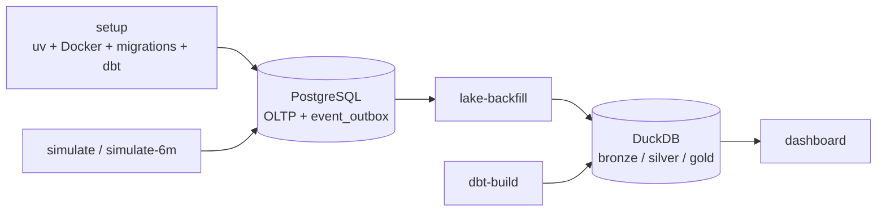

# Execute Project — Operational runbook

This is the practical guide for running `card-data-lab` locally. For project gates and parallel work, use [EXECUTION_PLAN.md](../EXECUTION_PLAN.md). For tool concepts, see [uv_taskipy_learning.md](uv_taskipy_learning.md) and [dbt_learning.md](dbt_learning.md).

## Operating model



The key writer sequence is:

```text
simulate → lake-backfill → dbt-build → dashboard / ML reads
```

DuckDB allows one writer. Close a DuckDB CLI, DBeaver DuckDB connection, or other writer before running `lake-backfill`, `warehouse-refresh`, `dbt-build`, or `dbt-test`.

## Prerequisites

| Tool | Check | Used for |
|---|---|---|
| Docker | `docker ps` | PostgreSQL and Portainer containers. |
| uv | `uv --version` | Locked Python environment and Taskipy execution. |
| Python ≥ 3.12 | managed through uv | Project runtime. |

The project uses the PostgreSQL host port `5433`, because host port `5432` may already be occupied by another local service.

## Fastest setup

```bash
# Full bootstrap; Streamlit starts in the current terminal when complete.
uv run task setup

# Bootstrap PostgreSQL and DuckDB/dbt, but leave the terminal available.
START_DASHBOARD=0 uv run task setup
```

[`setup_project.sh`](../setup_project.sh) performs five ordered steps:

1. `uv sync` creates or reconciles `.venv` from `uv.lock`.
2. `uv run task infra` starts PostgreSQL and Portainer.
3. The script waits for `pg_isready` so migrations do not race PostgreSQL startup.
4. It applies OLTP migrations and creates `bronze.raw_events` through `lake-init`.
5. It builds dbt bronze/silver/gold tables, then starts Streamlit unless `START_DASHBOARD=0`.

The setup path is repeatable: Docker startup, migrations, lake initialization, and dbt table materialization are designed to be rerun. It does not erase existing PostgreSQL or DuckDB data.

## Configuration

Defaults work with [docker-compose.yml](../docker-compose.yml).

| Variable | Default | Meaning |
|---|---|---|
| `PGHOST` | `localhost` | PostgreSQL host. |
| `PGPORT` | `5433` | PostgreSQL host port. |
| `PGUSER` / `PGPASSWORD` | `cardlab` / `cardlab` | PostgreSQL credentials. |
| `PGDATABASE` | `cardlab` | PostgreSQL database name. |
| `LAKE_PATH` | `lake/events.duckdb` | Lake file used by the outbox worker. Useful for isolated experiments/tests. |
| `DASHBOARD_DB_PATH` | `lake/events.duckdb` | Lake file opened read-only by Streamlit. |
| `START_DASHBOARD` | `1` | Set to `0` to make setup finish without launching Streamlit. |
| `UV_CACHE_DIR` | uv default cache | Set a writable path, such as `/tmp/cardlab-uv-cache`, in restricted environments. |

Example with an isolated lake:

```bash
LAKE_PATH=/tmp/cardlab-demo.duckdb uv run task lake-init
```

## Task reference

Run `uv run task --list` to see the exact commands in the current checkout.

### Bootstrap and infrastructure

| Command | What it does | Writes state? |
|---|---|:---:|
| `uv run task setup` | Executes the full setup script and launches Streamlit. | ✓ |
| `START_DASHBOARD=0 uv run task setup` | Full setup without the foreground dashboard. | ✓ |
| `uv run task infra` | Runs `docker compose up -d`; starts `cardlab-postgres` and `cardlab-portainer`. | ✓ |
| `uv run task infra-down` | Stops/removes the Compose containers; named volumes retain data. | ✓ |
| `uv run task migrate` | Applies idempotent OLTP migrations from `oltp/migrations/`. | ✓ |

### API and synthetic journeys

| Command | What it does | Writes state? |
|---|---|:---:|
| `uv run task api` | Starts FastAPI with reload; current mounted slice is purchase authorization. | ✓ on requests |
| `uv run task simulate` | Generates the default seeded client/card/purchase history in PostgreSQL and `event_outbox`. | ✓ |
| `uv run task simulate-6m` | Generates 1,000 synthetic customers over six calendar months with historical timestamps. | ✓ |
| `uv run task pipeline-sample` | Runs `simulate`, then exports and rebuilds the warehouse. | ✓ |
| `uv run task pipeline-6m` | Runs `simulate-6m`, then exports and rebuilds the warehouse. | ✓ |

The simulator writes directly through the OLTP/outbox path; it does not call the FastAPI HTTP endpoint. This avoids local HTTP overhead while preserving the durable analytical event contract.

### Lake and warehouse

| Command | What it does | Writes state? |
|---|---|:---:|
| `uv run task lake-init` | Creates `bronze.raw_events` without exporting events. Safe before the first simulation. | ✓ |
| `uv run task lake` | Exports one bounded outbox batch (default 5,000 rows), deduplicated by `event_id`. | ✓ |
| `uv run task lake-backfill` | Repeats bounded worker passes until no unpublished outbox rows remain. | ✓ |
| `uv run task dbt-build` | Builds physical bronze, silver, and gold tables and runs dbt tests. | ✓ |
| `uv run task dbt-test` | Runs dbt tests against existing warehouse tables; does not refresh models. | no |
| `uv run task warehouse-refresh` | Runs `lake-backfill && dbt-build`. Use after every simulation or outbox-producing workflow. | ✓ |

The physical warehouse contract is:

```text
bronze.raw_events + bronze.stg_* → silver.dim_* / silver.fct_* → gold.kpi_* / gold.obt_client_360
```

### Products and verification

| Command | What it does | Writes state? |
|---|---|:---:|
| `uv run task dashboard` | Starts the Streamlit dashboard; reads DuckDB read-only. | no |
| `uv run task ml-train` | Runs local ML experiments against silver data. | reports/artifacts only |
| `uv run task test-unit` | Runs fast unit tests; PostgreSQL is not required. | no |
| `uv run task test-db` | Runs database-focused tests. | isolated test data |
| `uv run task test-fast` | Runs schema, database, and service tests. | isolated test data |
| `uv run task test-all-ordered` | Runs schema → database → service → simulator → lake tests. | isolated test data |
| `uv run task test` | Runs `pytest -q`; DB-marked tests skip if PostgreSQL is unavailable. | isolated test data |
| `uv run task check` | Runs `test-fast`, then migrations. | isolated test data / migrations |
| `uv run task verify` | Runs the ordered project suite, then dbt tests. The lake must be unlocked. | test data only |

## Common workflows

### Develop the FastAPI authorization slice

```bash
uv run task infra
uv run task migrate
uv run task api
```

Use a separate terminal for `uv run task test-fast`. The API and tests need PostgreSQL; starting the API does not refresh DuckDB because the worker is intentionally decoupled.

### Create a quick analytical slice

```bash
uv run task pipeline-sample
uv run task dashboard
```

`pipeline-sample` is the shortest writer workflow that leaves the dashboard with fresh gold data.

### Create six months of dashboard history

```bash
uv run task pipeline-6m
uv run task dashboard
```

This writes a meaningful synthetic portfolio. Run it only when you intend to append synthetic clients/events to the local PostgreSQL database and rebuild the real lake.

### Refresh after events already exist

```bash
uv run task warehouse-refresh
```

Use this after API traffic, simulation, or a previously interrupted lake export. The worker’s `event_id` deduplication makes re-export safe; dbt replaces/rebuilds its physical models.

### Inspect containers and data

- Portainer: open [https://localhost:9443](https://localhost:9443) after `infra`; inspect `cardlab-postgres` health and logs.
- DBeaver PostgreSQL: host `localhost`, port `5433`, database/user/password `cardlab`.
- DBeaver DuckDB: open [`lake/events.duckdb`](../lake/events.duckdb) read-only; disconnect it before a warehouse writer runs.

The README has more detail and safe query examples in its [local infrastructure visualization section](../README.md).

## Recovery and troubleshooting

| Symptom | Cause | Recovery |
|---|---|---|
| PostgreSQL connection refused immediately after `infra` | Container is still starting. | Wait for health, or rerun `uv run task migrate`; `setup` already waits for readiness. |
| DB tests skip | PostgreSQL is unavailable or `PGPORT` is wrong. | Run `uv run task infra && uv run task migrate`; check `PGPORT=5433`. |
| `bronze.raw_events` missing | No lake initialization or worker export occurred. | Run `uv run task lake-init`, then `uv run task dbt-build`. |
| Dashboard says gold tables are missing | Lake did not receive an up-to-date dbt build. | Close DuckDB writers; run `uv run task warehouse-refresh`. |
| DuckDB file lock error | A CLI, DBeaver, worker, or dbt process owns the lake for writing. | Close the competing connection/process and rerun the writer command. |
| Warehouse shows only old dates | Six-month events are still in `event_outbox` or dbt is stale. | Run `uv run task warehouse-refresh`. |
| uv cache is read-only | Global cache path is unavailable in the shell/sandbox. | Prefix commands with `UV_CACHE_DIR=/tmp/cardlab-uv-cache`. |
| Setup exits before dashboard | A prerequisite failed. | Read the first failure, correct it, then rerun `uv run task setup`; it does not reset data. |

## Project locations

```text
pyproject.toml            # dependencies, Taskipy commands, pytest settings
setup_project.sh          # bootstrap orchestration
docker-compose.yml        # PostgreSQL + Portainer
oltp/                     # idempotent PostgreSQL DDL and migration runner
services/                 # FastAPI modular monolith and shared event contracts
simulator/run.py          # seeded, historical customer journey generator
worker/outbox_to_duckdb.py# bronze initialization, export, backfill, reconcile
warehouse/                # dbt project: bronze → silver → gold
dashboard/app.py          # read-only Streamlit KPI product
lake/events.duckdb        # local analytical warehouse file
learn-diary/              # execution, modelling, dbt, uv/Taskipy learning notes
```

## Next operational improvements

1. Add CI jobs for `verify` and dashboard smoke checks.
2. Add export audit records, leases, and retry ownership before concurrent workers are introduced.
3. Implement G7 run IDs, manifests, checkpoints, and isolated full-scale output paths before the 150k-customer workload.
4. Replace KPI proxies with card, limit, invoice, and payment facts as those event producers are implemented.
