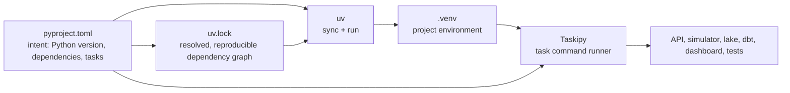
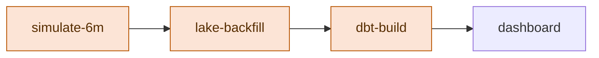
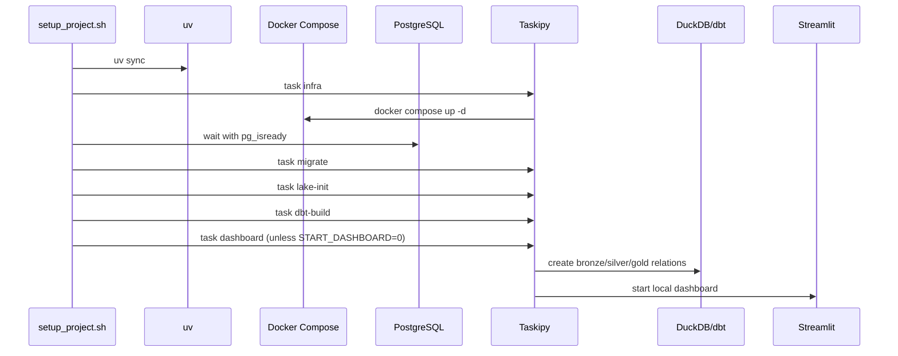

# uv and Taskipy learning guide — card-data-lab

This guide explains how this repository creates a reproducible Python project with **uv** and exposes its operations through **Taskipy**. It complements [execute_project.md](execute_project.md), which is the runbook; this guide explains why the tooling is structured this way.

## The relationship in one picture



`uv` owns Python environments and dependencies. Taskipy owns short names for repeatable shell commands. The normal command shape combines them:

```bash
uv run task <task-name>
```

Read it as: “run Taskipy from the repository’s resolved Python environment, then execute the named project operation.”

## The project files

| File | Owner | Why it matters |
|---|---|---|
| [`pyproject.toml`](../pyproject.toml) | Project source | Declares package metadata, Python requirement, dependencies, dev tools, Taskipy tasks, and pytest settings. |
| [`uv.lock`](../uv.lock) | uv-generated lockfile | Pins the complete resolved dependency graph for repeatable installs. Commit it. |
| `.venv/` | uv-generated local environment | Contains installed packages and entry points. Do not commit it. |
| [`setup_project.sh`](../setup_project.sh) | Repository operation | Uses `uv sync` and Taskipy tasks to bootstrap PostgreSQL, DuckDB, dbt, and Streamlit. |

### `pyproject.toml` is intent; `uv.lock` is the resolved result

The `[project]` table contains constraints such as `fastapi>=0.115` and `duckdb>=1.1`. These are not a complete, machine-identical environment by themselves. uv resolves them with all transitive dependencies and records exact choices in `uv.lock`.

```text
pyproject.toml  = what the project asks for
uv.lock         = the exact resolved answer
.venv           = one local installation of that answer
```

When application dependencies change, commit both `pyproject.toml` and `uv.lock`. Do not hand-edit `uv.lock`.

## Creating or restoring the project

### Existing repository: the normal path

```bash
uv sync
```

`uv sync` reads `pyproject.toml` and `uv.lock`, creates or updates `.venv`, and installs the locked environment. This is the first command for a new machine, a clean checkout, or after pulling dependency changes.

The repository requires Python `>=3.12`. uv selects a compatible interpreter when available; if it cannot, install a compatible Python through your local environment management process and rerun `uv sync`.

### New project: the conceptual sequence

The repository is already initialized, but its structure follows this sequence:

```bash
uv init
uv add fastapi uvicorn pydantic psycopg2-binary pandas duckdb
uv add --dev dbt-duckdb pytest streamlit taskipy
uv lock
uv sync
```

What each command means:

| Command | Effect |
|---|---|
| `uv init` | Creates a Python project skeleton and `pyproject.toml`. |
| `uv add package` | Adds a runtime dependency constraint, resolves, and updates the lockfile. |
| `uv add --dev package` | Adds a development-only tool to the `dev` dependency group, resolves, and updates the lockfile. |
| `uv lock` | Resolves dependencies and writes the lockfile without necessarily installing. |
| `uv sync` | Makes `.venv` match the locked environment. |
| `uv run command` | Ensures the command runs in the project environment. |

Use `uv add` rather than editing the dependency list by hand. It changes the declaration and lockfile together, giving reviewers a coherent dependency change.

## Runtime versus development dependencies

This project separates the dependencies needed by application code from development and operator tools.

| Group | Current examples | Why it belongs there |
|---|---|---|
| `[project].dependencies` | FastAPI, Uvicorn, Pydantic, PostgreSQL driver, pandas, DuckDB | Needed by the application, simulator, worker, or local runtime. |
| `[dependency-groups].dev` | dbt-duckdb, pytest, Streamlit, Taskipy, scikit-learn, httpx | Used for development, warehouse work, testing, dashboarding, or experiments. |

Taskipy itself is a development dependency. A stripped environment that intentionally excludes development tools cannot run `uv run task ...`; use the full project sync for local development and this repository’s operations.

## `uv run`: why commands do not call Python directly

Compare:

```bash
python -m simulator.run          # depends on whichever Python is active
uv run python -m simulator.run   # uses this repository's resolved .venv
```

`uv run` avoids accidental dependency drift between terminals, IDEs, CI, and contributors’ global Python installations. It also exposes installed command-line tools from the environment, such as `dbt`, `streamlit`, `pytest`, and `task`.

Useful direct commands:

```bash
uv run python -m simulator.run --months 6 --n-clients 1000 --seed 42
uv run pytest -q -m unit
uv run dbt --project-dir warehouse --profiles-dir warehouse ls
uv run task --list
```

Use a direct `uv run` command when exploring a tool. Promote it to a Taskipy task only after it is a stable, useful project workflow.

## Taskipy: the project’s command vocabulary

Taskipy reads `[tool.taskipy.tasks]` in `pyproject.toml`. Each key is a task name; each value is a shell command.

```toml
[tool.taskipy.tasks]
migrate = "python -m oltp.run_migrations"
lake-backfill = "python -m worker.outbox_to_duckdb --until-empty"
warehouse-refresh = "task lake-backfill && task dbt-build"
pipeline-6m = "task simulate-6m && task warehouse-refresh"
```

The dependency chain above is operationally meaningful, not only convenient:



The writer tasks must run sequentially because all write durable state and DuckDB accepts one writer. The dashboard and ML tasks are read consumers after the warehouse refresh finishes.

### Current task groups

| Group | Tasks | Purpose |
|---|---|---|
| Bootstrap | `setup`, `infra`, `infra-down`, `migrate` | Create the local runtime and apply operational schema. |
| API | `api` | Run FastAPI with reload. |
| Data generation | `simulate`, `simulate-6m`, `pipeline-sample`, `pipeline-6m` | Generate synthetic journeys and optionally publish them. |
| Lake and warehouse | `lake-init`, `lake`, `lake-backfill`, `dbt-build`, `dbt-test`, `warehouse-refresh` | Initialize, export, transform, and validate the analytical lake. |
| Products | `dashboard`, `ml-train` | Run read-oriented analytical products. |
| Verification | `test`, `test-unit`, `test-db`, `test-fast`, `test-all-ordered`, `verify`, `check` | Run targeted or composite quality checks. |

List the exact commands available in your checkout:

```bash
uv run task --list
```

## Composite tasks and shell semantics

Taskipy runs shell commands. This repository uses `&&` in composite tasks:

```toml
warehouse-refresh = "task lake-backfill && task dbt-build"
```

`&&` is important: if lake export fails, dbt does not run against stale data. The sequence stops at the first non-zero exit status.

When composing tasks:

1. Keep each leaf task independently useful and easy to diagnose.
2. Compose only steps with a clear dependency order.
3. Do not hide destructive data resets in convenience commands.
4. Prefer `&&` for dependent steps; use separate terminals only for truly independent read-only work.
5. Write the task description in README/Execution Plan when it changes operational state.

For example, `pipeline-6m` intentionally writes synthetic customers and events. It is not a harmless “demo” command. `warehouse-refresh` writes DuckDB, so a user must close a conflicting DuckDB CLI first.

## How the setup script integrates both tools

[`setup_project.sh`](../setup_project.sh) is a Bash wrapper for the normal operating sequence:



The script sets `UV_CACHE_DIR` to a writable temporary location when none is supplied. This is useful in constrained environments where a global uv cache is read-only. It also uses `set -euo pipefail`: stop on command errors, reject unset variables, and propagate pipeline failures.

Use it in either mode:

```bash
uv run task setup
START_DASHBOARD=0 uv run task setup
```

The second form is better for automation or when you want the terminal back after bootstrap.

## Safe dependency-change workflow

When adding a package, treat the dependency declaration, lockfile, and behavior as one change.

```bash
# Runtime dependency used by application code
uv add package-name

# Development/operator dependency
uv add --dev package-name

# Reconcile the local environment and verify affected workflows
uv sync
uv run task test-unit
uv run task --list
```

Checklist:

- Is the package required at runtime, or only for development/operator work?
- Does another existing package already provide the capability?
- Did `pyproject.toml` and `uv.lock` both change?
- Did the smallest relevant task still run?
- Does the README or learning diary need a new workflow entry?

Avoid `pip install` into `.venv` for project dependencies. It creates an environment state that `uv.lock` cannot reproduce. If a temporary tool is needed for a one-off inspection, keep it outside the project dependency model and do not make repository behavior depend on it.

## Common troubleshooting

| Symptom | Cause | Action |
|---|---|---|
| `uv` cannot write its cache | The default global cache directory is read-only. | Prefix the command with `UV_CACHE_DIR=/tmp/cardlab-uv-cache`, or choose another writable cache path. |
| `task: command not found` | The environment was not synced with dev tools, or the command bypassed uv. | Run `uv sync`, then use `uv run task ...`. |
| Task works in one terminal only | Another shell is using global Python or a different environment. | Always use `uv run`; compare `uv run python --version`. |
| `infra` cannot access Docker | Current user cannot access the Docker socket/daemon. | Start Docker and confirm local Docker permissions before rerunning. |
| `dbt-build` cannot lock the lake | A DuckDB writer/CLI still owns `lake/events.duckdb`. | Close the competing writer; then run `uv run task warehouse-refresh`. |
| Setup stops before dashboard | One prerequisite task failed by design. | Read the first failure, correct it, and rerun `uv run task setup`; setup steps are idempotent where possible. |

## Exercises

1. Run `uv run task --list` and identify which tasks write PostgreSQL, which write DuckDB, and which are read-only.
2. Read `pipeline-6m` in `pyproject.toml`, then expand the task chain manually in the terminal.
3. Run `START_DASHBOARD=0 uv run task setup` and explain why the script waits for `pg_isready` before migrations.
4. Add a temporary `hello` task locally, list it, run it, then remove it before committing.
5. Explain why `uv.lock` must change with `pyproject.toml` after `uv add`.

## Glossary

| Term | Meaning in this repository |
|---|---|
| uv | Python package/environment manager used to resolve, sync, and run the project. |
| Lockfile | `uv.lock`; the resolved dependency graph committed with the code. |
| Virtual environment | `.venv`; local installed packages and executables. |
| Dependency group | A named set of non-runtime tools, such as this project’s `dev` group. |
| Taskipy | Task runner that maps short task names to shell commands in `pyproject.toml`. |
| Composite task | A task that invokes other tasks in order, such as `warehouse-refresh`. |
| Idempotent | Safe to repeat without changing the intended final state, such as migration application or lake initialization. |
